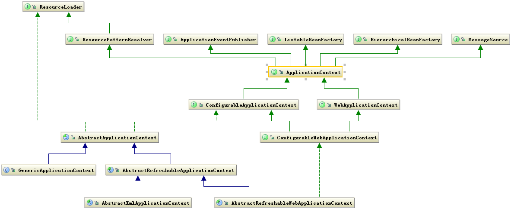
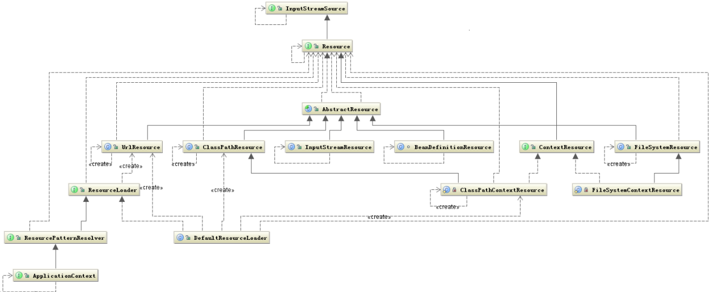
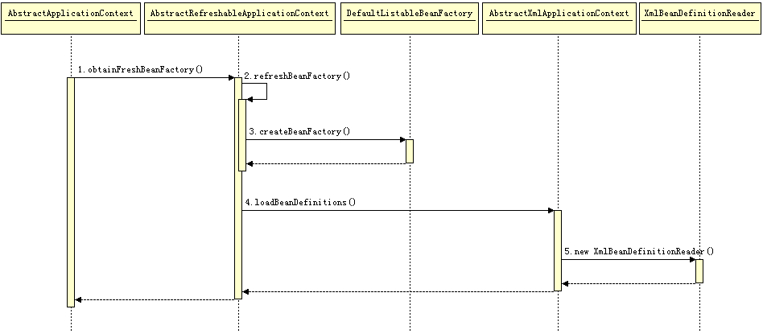

# Spring源代码和原理分析

> - assembled by hellmonky 
> - start at 2016年11月23日15:01:42


## 一 基本概念和准备
在开始源代码学习的过程中，需要有一些基本的环境支持来帮助我们方便的进行源代码的阅读；并且还需要有一些针对要阅读源代码的领域知识来帮助自己梳理整体思路。
在上述两者的综合作用下，才能有的放矢的去进行源代码的阅读和分析，帮助自己更为深刻的理解包含在源代码中的设计思想。

### 1 关于源代码阅读
一个开源框架在学习的过程中，最重要的就是理解了原理然后使用，在理解原理和使用的过程中能够方便的查看源代码是非常重要的。
以往主要有以下三种方式阅读规模庞大的源代码：
> - 1.本地软件完成对源代码的索引和阅读，例如sourceInsight；
> - 2.通过互联网上提供的网站来进行代码索引和阅读；
> - 3.搭建编译环境，将需要阅读的代码实际进行编译，然后在IDE中进行代码的索引和阅读；

上述三种方法，都有各自的明显的特点：
> - 1.第一种因为本地软件的匮乏和功能的不完善，并不能完整的覆盖需要阅读源代码的种类和范围，并且软件往往收费，个人用户使用成本高；
> - 2.第二种需要别人搭建好的网站提供服务，只能查询当前是否有人支持；
> - 3.第三种需要的资源很多，搭建过程比较复杂，但是搭建后可以修改代码进行编译，通过编译器调试可以方便动态理解整个源代码的流程。

综上所述，第一种方式已经趋向于淘汰；第二种方式虽然方便阅读，但是需要有对应的网络提供商支持，除了最热门的代码，小众代码并没有支持；第三种方式在需要实际编译的时候更为合适，如果只是简单阅读，成本太高。

如果有结合1和2这两个方面：支持自己导入源代码，使用网页浏览。这样的源代码阅读软件，对于非编译型需求来说已经非常足够了。
现在还有一个开源项目[OpenGrok](https://github.com/OpenGrok/OpenGrok)，就是通过搭建一个web服务来完成对用户导入的源代码的索引和浏览，完美贴合上述要求。

现在以本文着力需要分析的[spring-framework](https://github.com/spring-projects/spring-framework)为例，就来尝试搭建网页端源代码浏览和编译环境浏览这两种方式。

#### 1.1 使用OpenGrok搭建spring-framework源代码阅读环境：
根据[OpenGrok的官方指导教程](https://github.com/OpenGrok/OpenGrok/blob/master/README.txt)可知，如果不编译OpenGrok本身，只是通过release的可执行文件来搭建源代码阅读环境，只需要一下系统组件：
> - Latest Java (At least 1.8)
> - A servlet container like Tomcat (8.x or later)
> - Exuberant Ctags or Universal Ctags
> - Source Code Management installation

我已经安装好了：jdk1.8.0_102，apache-tomcat-8.5.8，ctag（已经添加到了系统环境变量中）和git for windows。

然后就可以进行如下步骤：

##### （1）下载OpenGrok最新release版本：
从[官方release](https://github.com/OpenGrok/OpenGrok/releases)下载最新的tar.gz包到本地，到目前为止，最新为opengrok-0.13-rc4.tar.gz；
将opengrok-0.13-rc4.tar.gz解压到指定路径，我这儿将解压缩到：
```shell
E:\0-bin\opengrok-0.13-rc4
```
文件夹下，然后将../opengrok-0.13-rc4/lib/source.war解压缩到apache-tomcat-8.5.8的webapp目录下。

##### （2）编辑source.war的web.xml配置文件：
使用编辑器打开../webapps/source.war/WEB-INF/web.xml，然后修改其中的配置项：
```shell
<context-param>
    <description>Full path to the configuration file where OpenGrok can read its configuration</description>
    <param-name>CONFIGURATION</param-name>
    <param-value>E:\0-bin\opengrok-0.13-rc4\data\configuration.xml</param-value>
</context-param>
```
保存后推出，将CONFIGURATION这个key的值设置为将要生成配置文件的路径，OpenGrok将会在这个路径下会生成configuration.xml文件。

##### （3）在OpenGrok解压缩目录下创建文件夹：
我们需要在OpenGrok的解压缩目录下创建文件夹来存放OpenGrok运行时需要的数据，创建data和source两个文件夹，这个时候的目录结构为：
```shell
-----
    |-bin
    |-data
    |-doc
    |-lib
    |-Management
    |-source
```

##### （4）在source文件夹下导入源代码：
接下来就需要在上述创建的source文件夹下导入需要阅读的源代码包了，这个使用git获取最新的Spring-framework源代码包：
```shell
git clone https://github.com/spring-projects/spring-framework.git
```
也可以将下载的源代码压缩包解压到这个文件夹下。
这儿有一个好处，在阅读linux代码的时候，由于windows不支持过多的目录层级导致linux源代码包无法在windows下正常解压，所以使用linux下的tomcat可以完美解决这个问题。

##### （5）创建源代码的索引：
在启动OpenGrok之前，需要使用ctag对当前导入在source文件夹下的源代码建立索引，并且将配置文件写入到data文件夹下，需要执行如下命令：
```shell
java -Xmx524m -jar opengrok.jar -W "E:\\0-bin\\opengrok-0.13-rc4\\data\\configuration.xml" -P -S -v -s "E:\\0-bin\\opengrok-0.13-rc4\\source" -d "E:\\0-bin\\opengrok-0.13-rc4\\data"
```

##### （6）启动OpenGrok：
启动tomcat服务器，就可以在网页中输入：
```shell
http://localhost:8080/source
```
来访问了。


参考文档：
[如何把 opengrok 安装在 windows上](http://blog.csdn.net/mickeyfirst/article/details/9044337)

#### 1.2 使用IDEA搭建spring-framework源代码阅读环境：
spring-framework官方默认使用eclipse来进行开发，并且提供了导入到eclipse的脚本来简化导入过程。但是现在也提供了导入到IDEA中进行源代码编译的文档，虽然没有eclipse那么方便，但是还是可以导入进行编译。
本节将参考[官方文档](https://github.com/spring-projects/spring-framework/blob/master/import-into-idea.md)完成对Spring-framework在IDEA中的导入和编译。

参考文档：
> - 1. [intellij idea搭建spring源码阅读环境](http://blog.csdn.net/sw277378347/article/details/44978493)


### 2 Spring的核心：
要理解Spring的核心，首先需要明确Spring被设计之初的定位是什么，然后通过这个定位来分析要实现它所需要依赖的基本技术，这些基本技术就是整个Spring的核心技术。

#### 2.1 Spring的设计理念：
Spring handles the infrastructure so you can focus on your application.
Spring目的：让对象与对象（模块与模块）之间的关系不通过代码来关联，而是通过配置类说明管理的（Spring根据这些配置 内部通过反射去动态的组装对象）。
通过将对象之间的依赖关系通过配置文件表达和管理，也就是所谓的依赖注入机制，Spring框架为开发人员提供了便利性，让开发人员专注于业务逻辑的实现。

整个java程序的运行可以看作是：构建一个数据结构，然后根据这个数据结构设计他的生存环境，并让它在这个环境中按照一定的规律在不停的运动，在它们的不停运动中设计一系列与环境或者与其他个体完成信息交换。
Spring在这个过程中能够帮助我们完成个体之间的信息交换，我们只需要负责设计个体各自的运动轨迹就可以了。

Spring是一个容器，凡是在容器里的对象才会有Spring所提供的这些服务和功能。

#### 2.2 Spring的核心框架：
Spring就是面向java Bean的编程（BOP,Bean Oriented Programming），Bean在Spring中才是真正的主角。然后Spring从这个角度从下到上组织了如下三个核心技术模块：
> - 1. Bean之间的依赖关系通过配置文件进行描述，这些配置文件描述了Bean之间的注入关系，然后被Spring用IoC来管理这些注入关系；
> - 2. 围绕Bean之间的交互活动，还需要Bean的运行上下文来提供运行场景和记录轨迹，Spring的Context组件就是包裹了Bean和Core的IoC容器，包含着Bean之间的相互关系；
> - 3. 为了方便Bean之间交互，还需要一些基本工具支持，Spring提供了Core组件，这个组件负责完成：发现、建立和维护每个Bean之间的关系所需要的一些列的工具，例如提供了统一的资源访问形式。


根据上述三个基本层次化的组件就搭建了整个Spring的骨骼，其他Spring组件和框架都是建立在这三个组件的基础上的。

##### 2.2.1 Bean组件：
Bean组件实现了将对象通过配置文件的方式，由Spring来管理对象存储空间，生命周期的分配。通过依赖注入的方式，可以实现将对象注入到指定的业务逻辑类中。这些注入关系，由Ioc容器来管理。
因此，Spring的核心思想常常被称作BOP(Bean Oriented Programming)，面向Bean编程。
Bean组件定义在Spring的org.springframework.beans包下，解决了以下几个问题：
> 1. Bean的定义
> 2. Bean的创建
> 3. Bean的解析

使用者只需要关注Bean的创建，其他两个过程由Spring内部完成，对用户来说是透明的。

Spring Bean的整体架构是典型的工厂模式，顶层的接口是BeanFactory，定义在：../spring-framework/spring-beans/src/main/java/org/springframework/beans/factory/BeanFactory.java 这个文件中。
具体的继承细节为：


ListableBeanFactory、HierarchicalBeanFactory和AutowireCapableBean是其三个直接子类，目的是为了区分Spring内部对象处理和转化的数据限制。
> 1. ListableBeanFactory: 表示这些Bean是可列表的
> 2. HierarchicalBeanFactory: 表示这些Bean有继承关系
> 3. AutowireCapableBeanFactory: 定义Bean的自动装配规则

这几个接口分别定义了Bean的集合、Bean的关系和Bean的行为。

###### 2.2.1.1 Bean的定义：
Bean的定义类层次核心是RootBeanDefinition，在源码的位置是：../spring-framework/spring-beans/src/main/java/org/springframework/beans/factory/support/RootBeanDefinition.java
继承关系为：


Spring的配置文件中定义的<bean/>节点，成功解析后都会被转化为BeanDefinition对象，之后所有的操作都会在BeanDefinition对象之上进行。

###### 2.2.1.2 Bean的解析：
Bean解析的主要任务是：对Spring的配置文件进行解析，最后生成BeanDefinition对象。解析过程非常复杂，包括配置文件里所有的tag。
Bean 的解析过程非常复杂，功能被分的很细，因为这里需要被扩展的地方很多，必须保证有足够的灵活性，以应对可能的变化。Bean 的解析主要就是对 Spring 配置文件的解析。这个解析过程主要通过下图中的类完成：


##### 2.2.2 Context组件：
Bean包装的是一个个Object，Object中存储着业务所需的数据。所以，如何给这些数据及之间的关系提供生存、运行环境（即保存对象的状态），就是Context要解决的问题。
Context组件在Spring中的作用，他实际上就是给Spring提供一个运行时的环境，用以保存各个对象的状态。Context实际上就是Bean关系的集合，又称之为Ioc容器。
ApplicationContext是Context的顶级父类接口，ApplicationContext标识了一个应用环境的基本信息。
层次关系如下：


从上述类继承层次关系图上可以看出：
ApplicationContext还继承了5个接口，用于拓展Context的功能，其中BeanFactory用于创建Bean，同时继承了ResourceLoader接口，用于访问任何外部资源。

ApplicationContext的子类主要包含两个方面：
> - 1. ConfigurableApplicationContext表示该Context是可修改的，也就是在构建Context中用户可以动态添加或修改已有的配置信息，它下面又有多个子类，其中最经常使用的是可更新的Context，即AbstractRefreshableApplicationContext类；
> - 2. WebApplicationContext顾名思义，就是为web准备的Context他可以直接访问到ServletContext，通常情况下，这个接口使用的少。

再往下分就是按照构建 Context 的文件类型，接着就是访问 Context 的方式。这样一级一级构成了完整的 Context 等级层次。总体来说 ApplicationContext 必须要完成以下几件事：
> - 标识一个应用环境
> - 利用 BeanFactory 创建 Bean 对象
> - 保存对象关系表
> - 能够捕获各种事件

Context 作为 Spring 的 Ioc 容器，基本上整合了 Spring 的大部分功能，或者说是大部分功能的基础。

##### 2.2.3 Core组件：
Core组件作为Spring的核心组件，他其中包含了很多的关键类，其中一个重要组成部分就是定义了资源的访问方式。这种把所有资源都抽象成一个接口的方式很值得在以后的设计中拿来学习。
下面就重要看一下这个部分在Spring的作用。
首先看看Resource相关的类结构图：


从上图可以看出Resource接口封装了各种可能的资源类型，也就是对使用者来说屏蔽了文件类型的不同。
对资源的提供者来说，如何把资源包装起来交给其他人用这也是一个问题，我们看到Resource接口继承了InputStreamSource接口，这个接口中有个getInputStream方法，返回的是InputStream类。这样所有的资源都被可以通过InputStream这个类来获取，所以也屏蔽了资源的提供者。另外还有一个问题就是加载资源的问题，也就是资源的加载者要统一，从上图中可以看出这个任务是由ResourceLoader接口完成，他屏蔽了所有的资源加载者的差异，只需要实现这个接口就可以加载所有的资源，他的默认实现是DefaultResourceLoader。

那么Context和Resource是如何建立关系的？首先看一下他们的类关系图：


从上图可以看出，Context是把资源的加载、解析和描述工作委托给了ResourcePatternResolver类来完成，他相当于一个接头人，他把资源的加载、解析和资源的定义整合在一起便于其他组件使用。
Core组件中还有很多类似的方式。

##### 2.2.4 三大组件的相互关系：
在基本了解了Spring-framework的三大组件的基本功能之后，我们需要将这三个组件的关联关系梳理一下。
**Ioc容器实际上就是Context组件结合Bean和Core这两个组件共同构建了一个Bean关系网。**
如何构建这个关系网？构建的入口就在AbstractApplicationContext类的refresh方法中，位于：..\spring-framework\spring-context\src\main\java\org\springframework\context\support\AbstractApplicationContext.java 文件中。我们将AbstractApplicationContext中的refresh方法简化提取出来：
```java
public void refresh() throws BeansException, IllegalStateException { 
    synchronized (this.startupShutdownMonitor) { 
        // 准备上下文用于刷新 
        prepareRefresh(); 
        // 在子类中启动refreshBeanFactory 
        ConfigurableListableBeanFactory beanFactory = obtainFreshBeanFactory(); 
        // 为该上下文配置已经生成的BeanFactory
        prepareBeanFactory(beanFactory); 
        try { 
            // 设置BeanFactory的后置处理
            postProcessBeanFactory(beanFactory); 
            // 调用BeanFactory的后处理器，这些后处理器是在Bean定义中向容器注册的，可以调用用户自定义的BeanFactory来对已经生成的BeanFactory进行修改
            invokeBeanFactoryPostProcessors(beanFactory); 
            // 注册Bean的后处理器，在Bean创建过程中调用，可以对以后再创建Bean实例对象添加一些自定义操作
            registerBeanPostProcessors(beanFactory); 
            // 对上下文的消息源进行初始化
            initMessageSource(); 
            // 初始化上下文中的事件机制
            initApplicationEventMulticaster(); 
            // 初始化其他的特殊Bean 
            onRefresh(); 
            // 检查监听Bean并且将这些Bean向容器注册
            registerListeners(); 
            // 实例化所有(non-lazy-init)单件 
            finishBeanFactoryInitialization(beanFactory); 
            // 发布容器事件，结束Refresh过程 
            finishRefresh(); 
        } 
        catch (BeansException ex) { 
            // Destroy already created singletons to avoid dangling resources. 
            destroyBeans(); 
            // Reset 'active' flag. 
            cancelRefresh(ex); 
            // Propagate exception to caller. 
            throw ex; 
        } 
    } 
}
```
整个方法代码使用的就是模板方式设计模式，工厂方法模式等，这个函数包含了整个Ioc容器过程的完整的代码。所以refresh是构建IOC的入口点。了解了里面的每一行代码基本上就了解大部分Spring的原理和功能了。
这段代码主要包含这样几个步骤：
> - 1. 构建 BeanFactory，以便于产生所需的“演员”
> - 2. 注册可能感兴趣的事件
> - 3. 创建 Bean 实例对象
> - 4. 触发被监听的事件

下面就结合上述代码，逐一分析这几个过程：

###### 2.2.4.1 创建和配置BeanFactory：
相关代码为：
```java
// Prepare this context for refreshing. 
prepareRefresh(); 
// 在子类中启动refreshBeanFactory 
ConfigurableListableBeanFactory beanFactory = obtainFreshBeanFactory(); 
```
这两句是在创建和配置BeanFactory。

BeanFactory创建是在AbstractApplicationContext的obtainFreshBeanFactory()方法中完成的。在该方法中，会调用子类实现了的refreshBeanFactory的方法，刷新子类，如果BeanFactory存在则刷新，如果不存在就创建一个新的BeanFactory。最终默认的创建BeanFactory就是由DefaultListableBeanFactory来完成的。
代码为：
```java
protected ConfigurableListableBeanFactory obtainFreshBeanFactory() {
		refreshBeanFactory();
		ConfigurableListableBeanFactory beanFactory = getBeanFactory();
		if (logger.isDebugEnabled()) {
			logger.debug("Bean factory for " + getDisplayName() + ": " + beanFactory);
		}
		return beanFactory;
	}
```
obtainFreshBeanFactory()方法中调用的子类实现的AbstractApplicationContext的抽象方法refreshBeanFactory()方法，具体代码位于：..\spring-framework\spring-context\src\main\java\org\springframework\context\support\AbstractRefreshableApplicationContext.java 文件中，具体函数实现为：
```java
    protected final void refreshBeanFactory() throws BeansException {
		if (hasBeanFactory()) {
			destroyBeans();
			closeBeanFactory();
		}
		try {
			DefaultListableBeanFactory beanFactory = createBeanFactory();
			beanFactory.setSerializationId(getId());
			customizeBeanFactory(beanFactory);
			loadBeanDefinitions(beanFactory);
			synchronized (this.beanFactoryMonitor) {
				this.beanFactory = beanFactory;
			}
		}
		catch (IOException ex) {
			throw new ApplicationContextException("I/O error parsing bean definition source for " + getDisplayName(), ex);
		}
	}
```
这段代码清楚的说明了BeanFactory的创建过程。
这儿需要注意BeanFactory对象的类型的变化，前面介绍了他有很多子类（例如三个直接子类：ListableBeanFactory、HierarchicalBeanFactory 和 AutowireCapableBeanFactory），在什么情况下使用不同的子类这非常关键。
BeanFactory的原始对象是DefaultListableBeanFactory，这个非常关键，因为他涉及到后面对这个对象的多种操作。

下面看一下DefaultListableBeanFactory类的继承层次类图：


从这个图中发现除了BeanFactory相关的类外，还发现了与Bean组件的register相关。
这在上述代码中的refreshBeanFactory()方法中的oadBeanDefinitions(beanFactory)将找到答案，这个方法将开始加载、解析Bean的定义，也就是把用户定义的数据结构转化为Ioc容器中的特定数据结构。



###### 2.2.4.2 用户自定义Bean的解析和注册：
上述过程中，完成了构建BeanFactory的标准初始化过程。解析来需要进一步分析如何解析和注册用户定义的Bean。
DefaultListableBeanFactory类中的loadBeanDefinitions(beanFactory)函数，将用户自定义的Bean定义加载和解析为默认DefaultListableBeanFactory类型的IoC容器中的数据结构。
调用了代码位于：..\spring-framework\spring-context\src\main\java\org\springframework\context\support\AbstractXmlApplicationContext.java 文件中AbstractXmlApplicationContext类的loadBeanDefinitions(DefaultListableBeanFactory beanFactory)方法：
```java
    protected void loadBeanDefinitions(DefaultListableBeanFactory beanFactory) throws BeansException, IOException {
		// Create a new XmlBeanDefinitionReader for the given BeanFactory.
		XmlBeanDefinitionReader beanDefinitionReader = new XmlBeanDefinitionReader(beanFactory);

		// Configure the bean definition reader with this context's
		// resource loading environment.
		beanDefinitionReader.setEnvironment(this.getEnvironment());
		beanDefinitionReader.setResourceLoader(this);
		beanDefinitionReader.setEntityResolver(new ResourceEntityResolver(this));

		// Allow a subclass to provide custom initialization of the reader,
		// then proceed with actually loading the bean definitions.
		initBeanDefinitionReader(beanDefinitionReader);
		loadBeanDefinitions(beanDefinitionReader);
	}
```
最后通过AbstractXmlApplicationContext类的loadBeanDefinitions(XmlBeanDefinitionReader reader)方法来根据指定的XmlBeanDefinitionReader来加载我们的Bean定义：
```java
    protected void loadBeanDefinitions(XmlBeanDefinitionReader reader) throws BeansException, IOException {
		Resource[] configResources = getConfigResources();
		if (configResources != null) {
			reader.loadBeanDefinitions(configResources);
		}
		String[] configLocations = getConfigLocations();
		if (configLocations != null) {
			reader.loadBeanDefinitions(configLocations);
		}
	}
```
函数中根据资源文件和路径来加载Bean的定义。在这里，一般只会执行其中的一个if语句。如果通过指定XML文件来说明Bean定义，那么这儿就对应的只设置了configLocations值，并没有设置configResources属性值，就会直接执行第二个if语句。
这里就会调用XmlBeanDefinitionReader的父类AbstractBeanDefinitionReader的一个重载方法loadBeanDefinitions()方法，这个最终是调用子类XmlBeanDefinitionReader的loadBeanDefinitions()方法来加载和解析用户定义的Bean。
标准Bean解析注册的时序图如下：


###### 2.2.4.3 Spring工具类的加载：
完成BeanFactory的初始化，完成用户自定义的Bean的加载、解析和注册之后，还需要调用prepareBeanFactory方法，添加一些Spring本身需要的一些工具类。
通过调用AbstractApplicationContext类中prepareBeanFactory()方法来完成：
```java
    protected void prepareBeanFactory(ConfigurableListableBeanFactory beanFactory) {
		// Tell the internal bean factory to use the context's class loader etc.
		beanFactory.setBeanClassLoader(getClassLoader());
		beanFactory.setBeanExpressionResolver(new StandardBeanExpressionResolver(beanFactory.getBeanClassLoader()));
		beanFactory.addPropertyEditorRegistrar(new ResourceEditorRegistrar(this, getEnvironment()));

		// Configure the bean factory with context callbacks.
		beanFactory.addBeanPostProcessor(new ApplicationContextAwareProcessor(this));
		beanFactory.ignoreDependencyInterface(EnvironmentAware.class);
		beanFactory.ignoreDependencyInterface(EmbeddedValueResolverAware.class);
		beanFactory.ignoreDependencyInterface(ResourceLoaderAware.class);
		beanFactory.ignoreDependencyInterface(ApplicationEventPublisherAware.class);
		beanFactory.ignoreDependencyInterface(MessageSourceAware.class);
		beanFactory.ignoreDependencyInterface(ApplicationContextAware.class);

		// BeanFactory interface not registered as resolvable type in a plain factory.
		// MessageSource registered (and found for autowiring) as a bean.
		beanFactory.registerResolvableDependency(BeanFactory.class, beanFactory);
		beanFactory.registerResolvableDependency(ResourceLoader.class, this);
		beanFactory.registerResolvableDependency(ApplicationEventPublisher.class, this);
		beanFactory.registerResolvableDependency(ApplicationContext.class, this);

		// Register early post-processor for detecting inner beans as ApplicationListeners.
		beanFactory.addBeanPostProcessor(new ApplicationListenerDetector(this));

		// Detect a LoadTimeWeaver and prepare for weaving, if found.
		if (beanFactory.containsBean(LOAD_TIME_WEAVER_BEAN_NAME)) {
			beanFactory.addBeanPostProcessor(new LoadTimeWeaverAwareProcessor(beanFactory));
			// Set a temporary ClassLoader for type matching.
			beanFactory.setTempClassLoader(new ContextTypeMatchClassLoader(beanFactory.getBeanClassLoader()));
		}

		// Register default environment beans.
		if (!beanFactory.containsLocalBean(ENVIRONMENT_BEAN_NAME)) {
			beanFactory.registerSingleton(ENVIRONMENT_BEAN_NAME, getEnvironment());
		}
		if (!beanFactory.containsLocalBean(SYSTEM_PROPERTIES_BEAN_NAME)) {
			beanFactory.registerSingleton(SYSTEM_PROPERTIES_BEAN_NAME, getEnvironment().getSystemProperties());
		}
		if (!beanFactory.containsLocalBean(SYSTEM_ENVIRONMENT_BEAN_NAME)) {
			beanFactory.registerSingleton(SYSTEM_ENVIRONMENT_BEAN_NAME, getEnvironment().getSystemEnvironment());
		}
	}
```
在这个方法中，为容器配置了ClassLoader、PropertyEditor和BeanPost-Processor等，从而为容器的启动做好了必要的准备工作。

该方法主要分成四部分：
####### 第一部分：
第一步，设置类加载器：
```java
beanFactory.setBeanClassLoader(getClassLoader());
```
首先设置class loader，默认是当前context线程的class loader。在实例化context class(默认：XmlWebApplicationContext)的时候会在父类DefaultResourceLoader的构造方法中定义了设置class loader的方法。默认调用ClassUtils.getDefaultClassLoader()方法设置，或者是由自定义的context class赋予。

第二步，设置EL表达式处理器StandardBeanExpressionResolver：
```java
beanFactory.setBeanExpressionResolver(new StandardBeanExpressionResolver(beanFactory.getBeanClassLoader()));
```
spring3增加了表达式语言的支持，默认可以使用#{bean.xxx}的形式来调用相关属性值。


第三步，设置属性编辑器注册类，用来注册相关的属性编辑器：
```java
beanFactory.addPropertyEditorRegistrar(new ResourceEditorRegistrar(this, getEnvironment()));
```
为BeanFactory添加一个属性编辑器注册表(PropertyEditorRegistrar),默认是一个ResourceEditorRegistrar编辑器注册表。

第四步，注册Aware接口处理器ApplicationContextAwareProcessor：
```java
beanFactory.addBeanPostProcessor(new ApplicationContextAwareProcessor(this));
```
添加了一个处理aware相关接口的beanPostProcessor扩展，主要是使用beanPostProcessor的postProcessBeforeInitialization()前置处理方法实现aware相关接口的功能，aware接口是用来给bean注入一些资源的接口，例如实现BeanFactoryAware的Bean在初始化后，Spring容器将会注入BeanFactory的实例相应的还有ApplicationContextAware、ResourceLoaderAware、ServletContextAware等等。
这儿的ApplicationContextAwareProcessor的职责是在bean创建完成之后触发该bean实现的所有Aware接口，比如ApplicationContextAware接口的setApplicationContext方法，EnvironmentAware接口的setEnvironment，xxxAware接口可以让应用代码持有容器中关键对象（比如ApplicationContext、Environment等）的引用，核心代码在ApplicationContextAwareProcessor的postProcessBeforeInitialization函数调用的invokeAwareInterfaces方法：
```java
    private void invokeAwareInterfaces(Object bean) {
		if (bean instanceof Aware) {
			if (bean instanceof EnvironmentAware) {
				((EnvironmentAware) bean).setEnvironment(this.applicationContext.getEnvironment());
			}
			if (bean instanceof EmbeddedValueResolverAware) {
				((EmbeddedValueResolverAware) bean).setEmbeddedValueResolver(this.embeddedValueResolver);
			}
			if (bean instanceof ResourceLoaderAware) {
				((ResourceLoaderAware) bean).setResourceLoader(this.applicationContext);
			}
			if (bean instanceof ApplicationEventPublisherAware) {
				((ApplicationEventPublisherAware) bean).setApplicationEventPublisher(this.applicationContext);
			}
			if (bean instanceof MessageSourceAware) {
				((MessageSourceAware) bean).setMessageSource(this.applicationContext);
			}
			if (bean instanceof ApplicationContextAware) {
				((ApplicationContextAware) bean).setApplicationContext(this.applicationContext);
			}
		}
	}
```
然后设置了几个忽略自动装配的接口，因为这些接口已经通过ApplicationContextAwareProcessor注入了。默认只有BeanFactoryAware被忽略，其他的都要自行设置，这里设置了ResourceLoaderAware、ApplicationEventPublisherAware、MessageSourceAware和ApplicationContextAware：
```java
beanFactory.ignoreDependencyInterface(EnvironmentAware.class);
beanFactory.ignoreDependencyInterface(EmbeddedValueResolverAware.class);
beanFactory.ignoreDependencyInterface(ResourceLoaderAware.class);
beanFactory.ignoreDependencyInterface(ApplicationEventPublisherAware.class);
beanFactory.ignoreDependencyInterface(MessageSourceAware.class);
beanFactory.ignoreDependencyInterface(ApplicationContextAware.class);
```

第五步，设置了几个自动装配的特殊规则：
```java
beanFactory.registerResolvableDependency(BeanFactory.class, beanFactory);
beanFactory.registerResolvableDependency(ResourceLoader.class, this);
beanFactory.registerResolvableDependency(ApplicationEventPublisher.class, this);
beanFactory.registerResolvableDependency(ApplicationContext.class, this);
```
如果是BeanFactory类型，则注入beanFactory对象，如果是ResourceLoader、ApplicationEventPublisher、ApplicationContext类型则注入当前对象（applicationContext对象）。
这样的话容器就把bean工厂和ApplicationContext跟上面几个类型绑定了，在应用代码就可以通过类型自动装配把工厂实例和ApplicationContext实例设置到自定义bean的属性中。
像下面的例子，beanFactory、resourceLoader、appContext、appEventPublisher这几个属性都会被自动设置，虽然没有在显示的在bean定义xml中注入它们：
```java
public class AutowireByTypeBean {  
  
    private Bean1 bean1;  
    private BeanFactory beanFactory;  
    private ResourceLoader resourceLoader;  
    private ApplicationEventPublisher appEventPublisher;  
    private ApplicationContext appContext;  
  
    public BeanFactory getBeanFactory() {  
        return beanFactory;  
    }  
  
    public void setBeanFactory(BeanFactory beanFactory) {  
        this.beanFactory = beanFactory;  
    }  
  
    public ResourceLoader getResourceLoader() {  
        return resourceLoader;  
    }  
  
    public void setResourceLoader(ResourceLoader resourceLoader) {  
        this.resourceLoader = resourceLoader;  
    }  
  
    public ApplicationEventPublisher getAppEventPublisher() {  
        return appEventPublisher;  
    }  
  
    public void setAppEventPublisher(ApplicationEventPublisher appEventPublisher) {  
        this.appEventPublisher = appEventPublisher;  
    }  
  
    public ApplicationContext getAppContext() {  
        return appContext;  
    }  
  
    public void setAppContext(ApplicationContext appContext) {  
        this.appContext = appContext;  
    }  
  
    public Bean1 getBean1() {  
        return bean1;  
    }  
  
    public void setBean1(Bean1 bean1) {  
        this.bean1 = bean1;  
    }  
  
}  
<bean id="autowireBean" class="spring.beans.autowire.AutowireByTypeBean"  
    autowire="byType"></bean>  
<bean id="bean1111" class="spring.beans.autowire.Bean1">  
    <property name="id" value="1"></property>  
</bean>
```


####### 第二部分：
```java
beanFactory.addBeanPostProcessor(new ApplicationListenerDetector(this));
```
这儿添加了一个处理ApplicationListener相关接口的beanPostProcessor扩展。
ApplicationListenerDetector实现了DestructionAwareBeanPostProcessor和MergedBeanDefinitionPostProcessor这两个接口。用来检测所有实现了ApplicationListener接口的bean并把它们注册到Application时间广播器中，当容器事件被激活时事件会传递到这些实现了ApplicationListener接口的bean。


####### 第三部分：
```java
if (beanFactory.containsBean(LOAD_TIME_WEAVER_BEAN_NAME)) {
    beanFactory.addBeanPostProcessor(new LoadTimeWeaverAwareProcessor(beanFactory));
    // Set a temporary ClassLoader for type matching.
    beanFactory.setTempClassLoader(new ContextTypeMatchClassLoader(beanFactory.getBeanClassLoader()));
}
```
处理LTW（LoadTimeWeaver）aware接口，增加一个bean后处理器LoadTimeWeaverAwareProcessor，让所有实现了LoadTimeWeaverAware接口的bean都可以持有LTW实例。

这部分判断是否定义了名为loadTimeWeaver的bean，如果定义了则添加loadTimeWeaver功能的beanPostProcessor扩展，并且创建一个临时的classLoader来让其处理真正的bean。
spring的loadTimeWeaver主要是通过instrumentation的动态字节码增强在装载期注入依赖。

####### 第四部分：
```java
if (!beanFactory.containsLocalBean(ENVIRONMENT_BEAN_NAME)) {
    beanFactory.registerSingleton(ENVIRONMENT_BEAN_NAME, getEnvironment());
}
if (!beanFactory.containsLocalBean(SYSTEM_PROPERTIES_BEAN_NAME)) {
    beanFactory.registerSingleton(SYSTEM_PROPERTIES_BEAN_NAME, getEnvironment().getSystemProperties());
}
if (!beanFactory.containsLocalBean(SYSTEM_ENVIRONMENT_BEAN_NAME)) {
    beanFactory.registerSingleton(SYSTEM_ENVIRONMENT_BEAN_NAME, getEnvironment().getSystemEnvironment());
}
```
注册环境Bean：
> - 检查当前Context是否定义了id为environment的bean，如果没有定义，把StandardEnvironment注册到容器中，id为environment，这个bean包含了所有系统变量和环境变量
> - 检查当前Context是否定义了id为systemProperties，如果没有定义，把系统变量Map注册到容器中，id为systemProperties
> - 检查当前Context是否定义了id为systemEnvironment，如果没有定义，把环境变量Map注册到容器中，id为systemEnvironment


###### 2.2.4.4 其它初始化与准备过程：
在BeanFactory创建完成后，我们定义的Bean仅仅是已经被解析和注册了，实际上还没真正的创建他们的实例对象。当obtainFreshBeanFactory()方法返回后，就会为该上下文配置刚刚已经生成的BeanFactory，如果我们要想扩展Spring的IOC容器，AbstractApplicationContext中接下来的三行代码对Spring的功能扩展性起了至关重要的作用，我们可以通过下面的三个代码处进行自定义操作：
```java
// Allows post-processing of the bean factory in context subclasses.
postProcessBeanFactory(beanFactory);
// Invoke factory processors registered as beans in the context.
invokeBeanFactoryPostProcessors(beanFactory);
// Register bean processors that intercept bean creation.
registerBeanPostProcessors(beanFactory);
```
总体上，前两行主要是让你现在可以对已经构建的BeanFactory的配置做修改，后面一行就是让你可以对以后再创建Bean的实例对象时添加一些自定义的操作。
需要注意，在后面两行中，传入的beanFactory为上面的context中的DefaultListableBeanFactory。

####### 自定义扩展点：
```java
postProcessBeanFactory(beanFactory);
```
该方法是spring的一个扩展点之一，是一个空方法，留给子类去扩展。子类可以重写该方法，对已经构建的BeanFactory的配置根据需要进行修改。
例如调用beanFactory.registerResolvableDependency，注入特殊的类。
扩展点是在bean等配置都已经加载但还没有进行实例化的时候。
例如上面说到的aware相关接口自动装配设置，假如是web项目，使用的是spring的webApplicationcontext，这时需要一些ServletContextAware相关的自动装配忽略及配置等，就需要在webApplicationContext里重写这个方法来实现相应功能。

####### 从spring配置文件中，获取实现BeanFactoryPostProcessor接口的bean：
```java
invokeBeanFactoryPostProcessors(beanFactory);
```
它的参数是 beanFactory，说明可以对 beanFactory 做修改，这里注意这个 beanFactory 是 ConfigurableListableBeanFactory 类型的，这也印证了前面介绍的不同 BeanFactory 所使用的场合不同，这里只能是可配置的 BeanFactory，防止一些数据被用户随意修改。
该方法的主要功能就是从spring配置文件中，获取实现 BeanFactoryPostProcessor 接口的bean，然后按不同的优先级顺序，依次执行BeanFactoryPostProcessor的 postProcessBeanFactory 方法。

通过这个调用，激活所有BeanFactoryPostProcessor接口，包括容器内置的和应用自定义的，所有的BFPP实现了PriorityOrdered接口归类并排序，实现了Ordered接口的归类并排序，未实现排序接口的归类，先按顺序执行实现了PriorityOrdered接口的BFPP，然后按顺序执行实现了Ordered接口的BFPP，最后执行未实现排序接口的BFPP。
其中还有个特殊的BFPP BeanDefinitionRegistryPostProcessor接口，它是用来扩展一些特殊的Bean定义，比如有个实现ConfigurationClassPostProcessor，它是用来处理@Configuration注解描述的bean定义，在bean定义文件中定义了<context:annotation-config />标签之后，容器会自动注册一个ConfigurationClassPostProcessor来对指定包中包含@Configuration注解的类进行解析。


跳转到这个方法在AbstractApplicationContext中的实现为：
```java
    protected void invokeBeanFactoryPostProcessors(ConfigurableListableBeanFactory beanFactory) {
		PostProcessorRegistrationDelegate.invokeBeanFactoryPostProcessors(beanFactory, getBeanFactoryPostProcessors());

		// Detect a LoadTimeWeaver and prepare for weaving, if found in the meantime
		// (e.g. through an @Bean method registered by ConfigurationClassPostProcessor)
		if (beanFactory.getTempClassLoader() == null && beanFactory.containsBean(LOAD_TIME_WEAVER_BEAN_NAME)) {
			beanFactory.addBeanPostProcessor(new LoadTimeWeaverAwareProcessor(beanFactory));
			beanFactory.setTempClassLoader(new ContextTypeMatchClassLoader(beanFactory.getBeanClassLoader()));
		}
	}
```
发现在调用invokeBeanFactoryPostProcessors函数后，该函数又将实现的步骤委托给PostProcessorRegistrationDelegate类：
```java
PostProcessorRegistrationDelegate.invokeBeanFactoryPostProcessors(beanFactory, getBeanFactoryPostProcessors())
```
进入位于：..\spring-framework\spring-context\src\main\java\org\springframework\context\support\PostProcessorRegistrationDelegate.java，可以看到其的实现：
```java
    public static void invokeBeanFactoryPostProcessors(
			ConfigurableListableBeanFactory beanFactory, List<BeanFactoryPostProcessor> beanFactoryPostProcessors) {

		// Invoke BeanDefinitionRegistryPostProcessors first, if any.
		Set<String> processedBeans = new HashSet<>();

		if (beanFactory instanceof BeanDefinitionRegistry) {
			BeanDefinitionRegistry registry = (BeanDefinitionRegistry) beanFactory;
			List<BeanFactoryPostProcessor> regularPostProcessors = new LinkedList<>();
			List<BeanDefinitionRegistryPostProcessor> registryPostProcessors =
					new LinkedList<>();

			for (BeanFactoryPostProcessor postProcessor : beanFactoryPostProcessors) {
				if (postProcessor instanceof BeanDefinitionRegistryPostProcessor) {
					BeanDefinitionRegistryPostProcessor registryPostProcessor =
							(BeanDefinitionRegistryPostProcessor) postProcessor;
					registryPostProcessor.postProcessBeanDefinitionRegistry(registry);
					registryPostProcessors.add(registryPostProcessor);
				}
				else {
					regularPostProcessors.add(postProcessor);
				}
			}

			// Do not initialize FactoryBeans here: We need to leave all regular beans
			// uninitialized to let the bean factory post-processors apply to them!
			// Separate between BeanDefinitionRegistryPostProcessors that implement
			// PriorityOrdered, Ordered, and the rest.
			String[] postProcessorNames =
					beanFactory.getBeanNamesForType(BeanDefinitionRegistryPostProcessor.class, true, false);

			// First, invoke the BeanDefinitionRegistryPostProcessors that implement PriorityOrdered.
			List<BeanDefinitionRegistryPostProcessor> priorityOrderedPostProcessors = new ArrayList<>();
			for (String ppName : postProcessorNames) {
				if (beanFactory.isTypeMatch(ppName, PriorityOrdered.class)) {
					priorityOrderedPostProcessors.add(beanFactory.getBean(ppName, BeanDefinitionRegistryPostProcessor.class));
					processedBeans.add(ppName);
				}
			}
			sortPostProcessors(beanFactory, priorityOrderedPostProcessors);
			registryPostProcessors.addAll(priorityOrderedPostProcessors);
			invokeBeanDefinitionRegistryPostProcessors(priorityOrderedPostProcessors, registry);

			// Next, invoke the BeanDefinitionRegistryPostProcessors that implement Ordered.
			postProcessorNames = beanFactory.getBeanNamesForType(BeanDefinitionRegistryPostProcessor.class, true, false);
			List<BeanDefinitionRegistryPostProcessor> orderedPostProcessors = new ArrayList<>();
			for (String ppName : postProcessorNames) {
				if (!processedBeans.contains(ppName) && beanFactory.isTypeMatch(ppName, Ordered.class)) {
					orderedPostProcessors.add(beanFactory.getBean(ppName, BeanDefinitionRegistryPostProcessor.class));
					processedBeans.add(ppName);
				}
			}
			sortPostProcessors(beanFactory, orderedPostProcessors);
			registryPostProcessors.addAll(orderedPostProcessors);
			invokeBeanDefinitionRegistryPostProcessors(orderedPostProcessors, registry);

			// Finally, invoke all other BeanDefinitionRegistryPostProcessors until no further ones appear.
			boolean reiterate = true;
			while (reiterate) {
				reiterate = false;
				postProcessorNames = beanFactory.getBeanNamesForType(BeanDefinitionRegistryPostProcessor.class, true, false);
				for (String ppName : postProcessorNames) {
					if (!processedBeans.contains(ppName)) {
						BeanDefinitionRegistryPostProcessor pp = beanFactory.getBean(ppName, BeanDefinitionRegistryPostProcessor.class);
						registryPostProcessors.add(pp);
						processedBeans.add(ppName);
						pp.postProcessBeanDefinitionRegistry(registry);
						reiterate = true;
					}
				}
			}

			// Now, invoke the postProcessBeanFactory callback of all processors handled so far.
			invokeBeanFactoryPostProcessors(registryPostProcessors, beanFactory);
			invokeBeanFactoryPostProcessors(regularPostProcessors, beanFactory);
		}

		else {
			// Invoke factory processors registered with the context instance.
			invokeBeanFactoryPostProcessors(beanFactoryPostProcessors, beanFactory);
		}

		// Do not initialize FactoryBeans here: We need to leave all regular beans
		// uninitialized to let the bean factory post-processors apply to them!
		String[] postProcessorNames =
				beanFactory.getBeanNamesForType(BeanFactoryPostProcessor.class, true, false);

		// Separate between BeanFactoryPostProcessors that implement PriorityOrdered,
		// Ordered, and the rest.
		List<BeanFactoryPostProcessor> priorityOrderedPostProcessors = new ArrayList<>();
		List<String> orderedPostProcessorNames = new ArrayList<>();
		List<String> nonOrderedPostProcessorNames = new ArrayList<>();
		for (String ppName : postProcessorNames) {
			if (processedBeans.contains(ppName)) {
				// skip - already processed in first phase above
			}
			else if (beanFactory.isTypeMatch(ppName, PriorityOrdered.class)) {
				priorityOrderedPostProcessors.add(beanFactory.getBean(ppName, BeanFactoryPostProcessor.class));
			}
			else if (beanFactory.isTypeMatch(ppName, Ordered.class)) {
				orderedPostProcessorNames.add(ppName);
			}
			else {
				nonOrderedPostProcessorNames.add(ppName);
			}
		}

		// First, invoke the BeanFactoryPostProcessors that implement PriorityOrdered.
		sortPostProcessors(beanFactory, priorityOrderedPostProcessors);
		invokeBeanFactoryPostProcessors(priorityOrderedPostProcessors, beanFactory);

		// Next, invoke the BeanFactoryPostProcessors that implement Ordered.
		List<BeanFactoryPostProcessor> orderedPostProcessors = new ArrayList<>();
		for (String postProcessorName : orderedPostProcessorNames) {
			orderedPostProcessors.add(beanFactory.getBean(postProcessorName, BeanFactoryPostProcessor.class));
		}
		sortPostProcessors(beanFactory, orderedPostProcessors);
		invokeBeanFactoryPostProcessors(orderedPostProcessors, beanFactory);

		// Finally, invoke all other BeanFactoryPostProcessors.
		List<BeanFactoryPostProcessor> nonOrderedPostProcessors = new ArrayList<>();
		for (String postProcessorName : nonOrderedPostProcessorNames) {
			nonOrderedPostProcessors.add(beanFactory.getBean(postProcessorName, BeanFactoryPostProcessor.class));
		}
		invokeBeanFactoryPostProcessors(nonOrderedPostProcessors, beanFactory);

		// Clear cached merged bean definitions since the post-processors might have
		// modified the original metadata, e.g. replacing placeholders in values...
		beanFactory.clearMetadataCache();
	}
```
这个实现比较长，上面的处理的方法有点多，不过我们可以总结如下：
> - 1. 对BeanFactoryRegistry类型的处理
> - 2. 硬编码注册的后处理器
> - 3. 配置注册的后处理器
> - 4. 对于配置中读取的BeanFactoryPostProcessor的处理
> - 5. 进行相应的排序处理

其中的调用invokeBeanFactoryPostProcessors方法：
```java
    private static void invokeBeanFactoryPostProcessors(
			Collection<? extends BeanFactoryPostProcessor> postProcessors, ConfigurableListableBeanFactory beanFactory) {

		for (BeanFactoryPostProcessor postProcessor : postProcessors) {
			postProcessor.postProcessBeanFactory(beanFactory);
		}
	}
```
可以看到这个方法主要是获取实现 BeanFactoryPostProcessor 接口的子类，并执行它的 postProcessBeanFactory 方法。


####### 将所有实现BeanPostProcessor接口的bean注册到工厂中：
```java
registerBeanPostProcessors(beanFactory);
```
把所有实现BeanPostProcessor接口的bean注册到工厂中，为后面激活这些BPP做准备，所有实现了PriorityOrdered接口的归类并排序，实现了Ordered接口的归类并排序，未实现排序接口的归类，还有一个BPP扩展MergedBeanDefinitionPostProcessor接口，实现了这个接口的bean也单独归类，这个接口在容器中有一些实现：AutowiredAnnotationBeanPostProcessor、InitDestroyAnnotationBeanPostProcessor、RequiredAnnotationBeanPostProcessor、ApplicationListenerDetector，它们分别处理@Autowired、@PostConstructed和@PreDestroy注解、@Required注解、检测ApplicationListener接口。容器会额外注册一个ApplicationListenerDetector BPP用来检测所有实现了ApplicationListener接口的bean并把它们注册到Application时间广播器中，当容器事件被激活时事件会传递到这些实现了ApplicationListener接口的bean。


###### 2.2.4.5 创建 Bean 实例并构建 Bean 的关系网：
```java
// Initialize message source for this context.
initMessageSource();

// Initialize event multicaster for this context.
initApplicationEventMulticaster();

// Initialize other special beans in specific context subclasses.
onRefresh();

// Check for listener beans and register them.
registerListeners();
```


PS:关于这个Context，其实只要构造一个完整的语言的解析环境，语言的上下文就是无法避免的东西，例如在实现Scheme解析器中，就需要实现一个上下文环境，整个过程和上述过程是非常类似的。
并且在IDEA中可以将上述所有类继承关系图描述清楚。


参考文档：
> - 1. [Spring 框架的设计理念与设计模式分析](https://www.ibm.com/developerworks/cn/java/j-lo-spring-principle/)
> - 2. [Spring的IOC容器创建过程深入剖析](http://computerdragon.blog.51cto.com/6235984/1244016)
> - 3. [spring加载过程，源码带你理解从初始化到bean注入](http://zk-chs.iteye.com/blog/2293013)
> - 4. [Spring IoC实现解析](http://wanglizhi.github.io/2016/07/19/Spring-Ioc/)
> - 5. [spring源码学习笔记-初始化（一）-概览](http://blog.csdn.net/yalier888/article/details/9311981)
> - 6. [spring源码学习笔记-初始化（二）-BeanFactory](http://blog.csdn.net/yalier888/article/details/9311997)
> - 7. [spring源码学习笔记-初始化（三）-BeanFactory](http://blog.csdn.net/yalier888/article/details/9312037)
> - 8. [spring源码学习笔记-初始化（四）-PostProcessor](http://blog.csdn.net/yalier888/article/details/9312077)
> - 9. [spring源码学习笔记-初始化（五）-MessageSource/事件监听器](http://blog.csdn.net/yalier888/article/details/9312083)
> - 10. [spring源码学习笔记-初始化（六）-完成及异常处理](http://blog.csdn.net/yalier888/article/details/9312095)


#### 2.3 Spring实现的核心技术要点和设计模式：
明白了Spring-framework的核心框架后，我们更为详细的看看在完成这个框架搭建过程中使用的java技术要点和涉及到的设计模式。
设计模式是经过长时间编码之后，经过系统性的总结所提出的针对某一类问题的最佳解决方案，又称之为最佳实践。Spring作为一个成熟的框架，在设计的时候就使用了大量的设计模式来帮助梳理整个代码结构的组织形式。


##### 2.3.1 Bean组件相关：
将AbstractBeanDefinition的代码简化提取出来为：
```java
public abstract class AbstractBeanDefinition extends BeanMetadataAttributeAccessor implements BeanDefinition, Cloneable {
 private volatile Object beanClass;
    private String scope;//默认scope为“”，相当于单例 
    private boolean singleton;//bean默认为单例的
    private boolean prototype;//bean默认不是原型的  
    private boolean abstractFlag;//bean默认不是抽象的 
    private boolean lazyInit;//bean默认不开启延迟初始化
    private int autowireMode;//bean默认自动装配功能是关闭的
    private int dependencyCheck;//bean的默认依赖检查方式 
    private String[] dependsOn;//这个bean要初始化依赖的bean名称数组 
    private boolean autowireCandidate;//自动装配候选者  
    private boolean primary;//默认不是主要候选者
    private final Map<String, AutowireCandidateQualifier> qualifiers;//用于记录Qualifier，对应子元素qualifier
    private boolean nonPublicAccessAllowed;//允许访问非公开的构造器和方法
    private boolean lenientConstructorResolution;//是否以一种宽松的模式解析构造函数，默认true
    private ConstructorArgumentValues constructorArgumentValues;//记录构造函数注入属性，对应bean属性constructor-arg
    private MutablePropertyValues propertyValues;//普通属性集合
    private MethodOverrides methodOverrides;//方法重写持有者
    private String factoryBeanName;// 对应bean属性: factory-bean
    private String factoryMethodName;//对应bean属性: factory-method
    private String initMethodName;//初始化方法，对应bean属性: init-method
    private String destroyMethodName;// 销毁方法，对应destory-method
    private boolean enforceInitMethod;// 是否执行init-method
    private boolean enforceDestroyMethod;//是否执行destory-method
    private boolean synthetic;//是否是用户定义的而不是应用程序本身定义的
    private int role;//定义这个bean的应用
    private String description;// bean的描述
    private Resource resource; //bean定义的资源
}
```

参考文档：
> - 1. [Spring IoC实现解析](http://wanglizhi.github.io/2016/07/19/Spring-Ioc/)


#### 2.4 Spring实现依赖的程序设计语言要素：
上述Spring设计理念中描述的内容，并不局限于java语言，那么为什么Spring是一个java框架，而不是一个C++或者Python框架？
所以Spring的理念的实现也是需要一些语言特性支持的，我们来分析下要完成上述理念，一门包含哪些特性的语言可以实现一个Spring框架，以及是否真的有对应的框架已经被实现了。

**使用java实现的Spring-framework最基本的需求就是IoC，而IoC依赖于DI（Dependency Injection），而DI又需要GC的（Garbage Collection）支持。**
要理解这点，我们从头进行梳理。

##### 2.3.1 Spring最基本的对Bean的管理：
Spring-framework在管理Bean的时候，使用配置文件也好，使用注解也好，都是将这个Bean的创建方法（也就是Bean的定义的class文件）进行了记录，然后Spring-framework能够通过在需要的时候找到这个Bean的时候然后创建出这个Bean来。
这儿就使用了java的反射来完成运行时的Bean的动态创建：通过Spring中的配置文件或者注解，找到这个Bean对应的class文件，然后动态生成Bean的实例，然后调用对象中的方法。

##### 2.3.2 Spring的DI：
Spring-framework还通过配置文件或者注解，记录了Bean之间的相互依赖关系（注入关系），然后通过这个关系描述，将运行时动态生成的


http://stackoverflow.com/questions/352885/dependency-injection-in-c


#### 2.5 Spring能被用来干什么：
详细的了解了Spring的设计理念和核心技术，从技术的角度出发来看看Spring能够干什么，是非常有利于理解现在Spring正在干什么的。


### 3 Spring的三个基础组件分析：


### 4 关于建立在Spring框架上的java生态环境：


使用持续集成方式将当前整个项目环境进行搭建：
参考文档：
[centos＋Jenkins＋maven＋nginx，完整搭建持续集成小结](https://testerhome.com/topics/4043)

使用jekins调用docker来管理服务：[持续集成环境的搭建（基于 Jenkins、Docker、Git）](http://yyqian.com/post/1460773574738/)

使用环境隔离来完成基本的持续集成方案，将当前的程序设计流程更为合理化的处理，使用自动脚本来减少人为的部署工作量，集中精力于软件设计上。

对于本地系统的监控：
[用python 10min手写一个简易的实时内存监控系统](https://github.com/shengxinjing/my_blog/issues/1)


关于SpringBoot中静态资源的访问：
和传统的war包不同，现在使用的


Spring中最核心的理念就是提供服务，最典型的就是通过IoC来提供对基本java对象的管理，然后在这个基础上完成一些列的后续服务支持。
IoC就是Inversion of Control，将用户自己创建所需要对象的过程，通过服务帮助自动完成，不用关心具体的构造过程。
关键概念：
被注入对象：就是当前需要调用其它类完成功能的类；
被依赖对象：就是被调用的类。
正常状态下被注入的对象会直接依赖于被依赖的对象，需要我们主动获取被依赖的对象；IoC帮助我们管理被依赖的对象，然后帮我们自动注入到被注入的对象中去。

我们只需要在用到依赖对象的时候，他能够准备好就够了，完全不用考虑是自己准备的还是别人送过来。
Spring虽然发展了很多年，但是其内核结构并没有发生重大变化，所以从Spring的实现的基础原理来理解整个Spring


重要更改：
（1）SaaS改为SOA，这两者之间的理念还是不同的，并且现在强调开发为微服务架构，有一个概念上的清晰理解；
（2）强调对Spring和SpringBoot之间的演进关系的表述，根据项目时间来进行安排；
这个可以参考：[为什么做java的web开发我们会使用struts2，springMVC和spring这样的框架?](http://www.cnblogs.com/sharpxiajun/p/3936268.html)
（3）对于大数据方面的描述不够多，并且不确切，需要一个完整的思路展现；
（4）面向对象设计中的思路展示：需要描述一个要实现的目标，然后使用接口来组织较为复杂的类继承关系层次结构来完成满足要求的整体设计。
这一点在Spring整体框架中就非常明显，并且给出了一个非常好的实例来学习。


