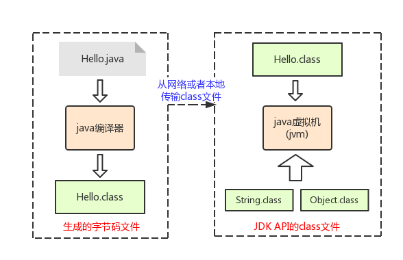
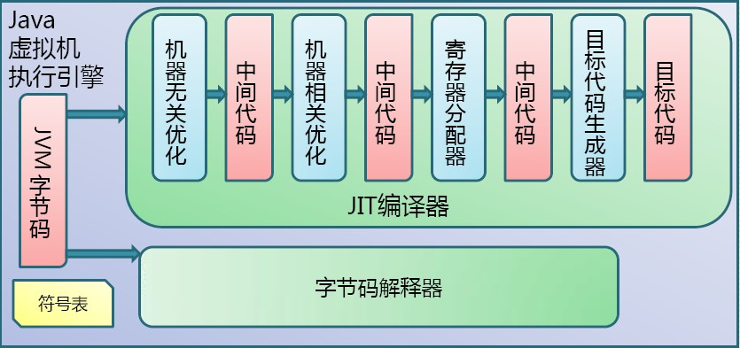
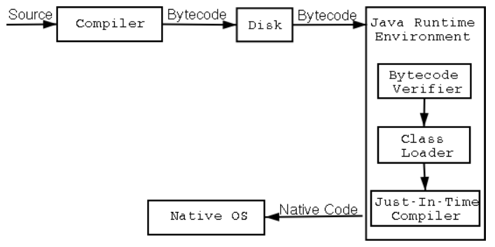
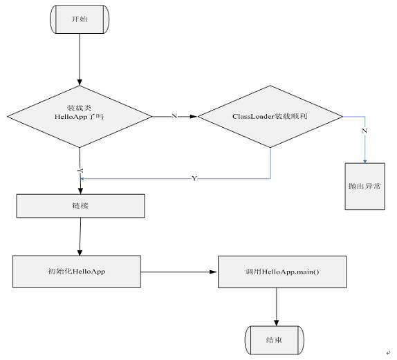

### JVM模型：
java代码可以编译为class文件，然后在运行时通过将这个class文件加载到JVM（Java virtual machine）中来执行代码，通过这种方式，JVM屏蔽了与具体平台相关的信息，使Java语言编译程序只需要生成在JVM上运行的目标字节码（.class）,就可以在多种平台上不加修改地运行。JVM 是编译后的Java程序（.class文件）和硬件系统之间的接口。
并且JVM设计之初就考虑到了语言无关性，只要能够编译为class文件，就能使用JVM执行。

#### java程序运行原理：

##### java程序从编译到运行流程：
java的一大特色就是”write once, run anywhere” 即 “一次编译，到处运行”。就是说你不用专门为每个平台写一份代码，你写的Java程序在任何平台都能跑起来。
它的实现原理是在系统层面上又增加了一层虚拟机（Java Virtual Machine，简称JVM），且为每个平台都定制了对应的虚拟机。然后Java程序是在虚拟机上跑的，因此平台无关。


Java的运行流程是：程序员写了源代码（Source Code，.java后缀，跨平台），然后经过编译器编译成字节码（Byte Code，.class后缀，二进制文件，跨平台），字节码是所有虚拟机都能理解的中间文件。然后交给虚拟机（不跨平台，每个平台都有对应的虚拟机）去运行。 所以对“write once, run anywhere”更准确的理解是，“一次编译，到处装虚拟机，所以到处运行”。

Java代码的编译时用java编译器完成的，输出的结果是jvm可识别的字节码：


编译完毕的字节码交给JVM来进行加载和执行：


通过上述步骤可以看出完整的流程为：



##### java程序的入口main函数：
在java中，main()方法是java应用程序的入口方法。java虚拟机通过main方法找到需要启动的运行程序，并且检查main函数所在类是否被java虚拟机装载。如果没有装载，那么就装载该类，并且装载所有相关的其他类。因此程序在运行的时候，第一个执行的方法就是main()方法。通常情况下， 如果要运行一个类的方法，必须首先实例化出来这个类的一个对象，然后通过"对象名.方法名()"的方式来运行方法，但是因为main是程序的入口，这时候还没有实例化对象，因此将main方法声明为static的，这样这个方法就可以直接通过“类名.方法名()”的方式来调用。

虚拟机通过调用某个指定类的方法main启动，传递给main一个字符串数组参数，使指定的类被装载，同时链接该类所使用的其它的类型，并且初始化它们。
例如：

```java
public class HelloApp {
    public static void main(String[] args) {
        System.out.println("Hello World!");
        for (int i = 0; i < args.length; i++) {
            System.out.println(args);
        }
    }
}
```
编译后在命令行模式下键入： java HelloApp run virtual machine
将通过调用HelloApp的方法main来启动java虚拟机，传递给main一个包含三个字符串"run"、"virtual"、"machine"的数组。现在我们略述虚拟机在执行HelloApp时可能采取的步骤：
（1）开始试图执行类HelloApp的main方法，发现该类并没有被装载，也就是说虚拟机当前不包含该类的二进制代表，于是虚拟机使用ClassLoader试图寻找这样的二进制代表。如果这个进程失败，则抛出一个异常。
（2）如果找到了这个类，那就就使用类加载器对HelloApp字节码进行装载。
（3）类被装载后同时在main方法被调用之前，必须对类HelloApp与其它类型进行链接然后初始化：
链接包含三个阶段：检验，准备和解析。检验检查被装载的主类的符号和语义，准备则创建类或接口的静态域以及把这些域初始化为标准的默认值，解析负责检查主类对其它类或接口的符号引用，在这一步它是可选的。
类的初始化是对类中声明的静态初始化函数和静态域的初始化构造方法的执行。一个类在初始化之前它的父类必须被初始化。
（4）完成HelloApp类和他需要的相关类的加载后，就可以调用main函数了，因为main是静态的，所以已经被初始化，可以顺利被调用。

流程图为：


##### java程序的main函数的执行原理：
这部分内容涉及到jvm的实现原理，可以参考文章：
[Java Main如何被执行？](http://www.cnblogs.com/iceAeterNa/p/4876940.html)


#### JVM的组成：
整个JVM 分为四部分：ClassLoader（类加载器）、Execution Engine（执行引擎）、Native Interface（本地接口）和Runtime data area（运行数据区）。
[JVM 的 工作原理，层次结构 以及 GC工作原理](https://segmentfault.com/a/1190000002579346)

##### 类加载器：类加载器的作用是加载符合class文件格式要求的类文件到内存，并不能保证这个类的运行状态是否正确。
程序在启动的时候，并不会一次性加载程序所要用的所有class文件，而是根据程序的需要，通过Java的类加载机制（ClassLoader）来动态加载某个class文件到内存当中的，从而只有class文件被载入到了内存之后，才能被其它class所引用。

Java默认提供的三个ClassLoader:
（1）BootStrap ClassLoader：称为启动类加载器，是Java类加载层次中最顶层的类加载器，不继承任何类，由当前系统的开发语言实现，负责加载JDK中的核心类库：默认为%JAVA_HOME%/lib，目录中或-Xbootclasspath中参数指定的路径中的，并且是虚拟机识别的（按名称）类库加载到JVM中。一般情况下，只要安装了Java运行环境（JRE），那么扩展目录为%JAVA_HOME%\jre\lib\。
可通过如下程序获得该类加载器从哪些地方加载了相关的jar或class文件：

```java
URL[] urls = sun.misc.Launcher.getBootstrapClassPath().getURLs();  
for (int i = 0; i < urls.length; i++) {  
    System.out.println(urls[i].toExternalForm());  
}
```
（2）Extension ClassLoader：称为扩展类加载器，继承自java.net.URLClassLoader，负责加载Java的扩展类库，默认加载%JAVA_HOME%\lib\ext目下的所有jar；一般情况下，只要安装了Java运行环境（JRE），那么扩展目录为%JAVA_HOME%\jre\lib\ext。
（3）System ClassLoader：称为系统类加载器，继承自java.net.URLClassLoader，负责加载应用程序%CLASSPATH%目录下的所有jar和class文件，以及其它自定义的ClassLoader，例如：CLASSPATH变量中的“.”便代表当前目录，即系统类加载器会从Java源代码所在的目录中去寻找Class文件。

上述三个类加载器是按照顺序形成了父子关系的，注意这里是通过组合而不是继承，这种层级结构也是只是语义上的定义：
首先，BootStrap ClassLoader加载后，会载入Extension ClassLoader，并将Extension ClassLoader的父类设为BootStrap ClassLoader；
然后，Extension ClassLoader接着载入System ClassLoader，并将System ClassLoader的父类设为Extension ClassLoader；
至此，BootStrap-->Extension-->System三级结构形成。

三者加载的jar和class文件的关系：
BootStrap ClassLoader负责加载sun.boot.class.path路径下的.class文件以及jar包：对应环境变量%JRE_HOME%/lib/的路径，也就是：rt.jar、resources.jar、charsets.jar和class等内容；
Extension ClassLoader负责加载java.ext.dirs路径下的.class文件以及jar包：对应%JRE_HOME%/lib/ext目录下的jar和class等；
System ClassLoader负责加载java.class.path路径下的.class文件以及jar包：对应用户自身的类路径，也就是.路径；

关于上述加载的jar文件包含的java类的说明：
tools.jar：该JAR包包含支持JDK中工具类和实用类的非核心类。它跟我们程序中用到的基础类库没有关系。我们注意到在Path中变量值bin目录下的各个exe工具的大小都很小，一般都在27KB左右，这是因为它们实际上仅仅相当于是一层代码的包装，这些工具的实现所要用到的类库都在tools.jar中，用压缩软件打开tools.jar,你会发现有很多文件是和bin目录下的exe工具相对性的。
dt.jar：BeanInfo使用的设计时（DesignTime）归档文件，该JAR包告诉IDE如何显示Java组件和如何让开发者定制它们，其中主要包含Swing的相关类。
rt.jar：引导类（组成Java平台核心API的运行时类），也就是编写程序时候import的类。
charsets.jar：字符转换类，用于国际化。

从虚拟机的角度来说，只存在两种不同的类加载器：一种是启动类加载器（Bootstrap ClassLoader），该类加载器使用C++语言实现，属于虚拟机自身的一部分，随着JVM启动。另外一种就是所有其它的类加载器，这些类加载器是由Java语言实现，独立于JVM外部，并且全部继承自抽象类java.lang.ClassLoader。
也就是说，上述Extension ClassLoader和App ClassLoader都是属于java提供的类加载器，不属于JVM部分。这两个类加载器由Extension ClassLoader完成构造并且启动。
如果需要定制ClassLoader的加载行为，这时候就需要自定义ClassLoader了，只要继承java.lang.ClassLoader类，通过：重写findClass方法（这个方法定义了ClassLoader查找class的方式），重写defineClass方法（将类文件字节码加载为jvm中的class）和重写findResource方法（定义查找资源的方式），来定义自己需要的类加载器。

类加载有两种机制：
隐式：运行过程中，碰到new方式生成对象时，隐式调用classLoader到JVM；
显式：通过class.forname()动态加载。

ClassLoader使用的是双亲委派模型（Parent Delegation Model）来搜索类的：
这个模型要求除了Bootstrap ClassLoader外，其余的类加载器都要有自己的父加载器。子加载器通过组合（Composition）来复用父加载器的代码，而不是使用继承（Inheritance）。在某个类加载器加载class文件时，它首先委托父加载器去加载这个类，依次传递到顶层类加载器(Bootstrap)。如果顶层加载不了（它的搜索范围中找不到此类），子加载器才会尝试加载这个类。
双亲委派模型最大的好处就是让Java类同其类加载器一起具备了一种带优先级的层次关系。比如我们要加载顶层的Java类——java.lang.Object类，无论我们用哪个类加载器去加载Object类，这个加载请求最终都会委托给Bootstrap ClassLoader，这样就保证了所有加载器加载的Object类都是同一个类。

类的加载过程采用双亲委托机制，这种机制能更好的保证Java平台的安全，同时也能避免重复加载。该模型要求除了顶层的Bootstrap class loader启动类加载器外，其余的类加载器都应当有自己的父类加载器。子类加载器和父类加载器不是以继承（Inheritance）的关系来实现，而是通过组合（Composition）关系来复用父加载器的代码。每个类加载器都有自己的命名空间（由该加载器及所有父类加载器所加载的类组成，在同一个命名空间中，不会出现类的完整名字（包括类的包名）相同的两个类；在不同的命名空间中，有可能会出现类的完整名字（包括类的包名）相同的两个类）。

双亲委派模型的工作过程为：
1.当前ClassLoader首先从自己已经加载的类中查询是否此类已经加载，如果已经加载则直接返回原来已经加载的类。每个类加载器都有自己的加载缓存，当一个类被加载了以后就会放入缓存，等下次加载的时候就可以直接返回了。
2.当前classLoader的缓存中没有找到被加载的类的时候，委托父类加载器去加载，父类加载器采用同样的策略，首先查看自己的缓存，然后委托父类的父类去加载，一直到 bootstrap ClassLoader。
3.当所有的父类加载器都没有加载的时候，再由当前的类加载器加载，并将其放入它自己的缓存中，以便下次有加载请求的时候直接返回。
通过这散布就完成了查询和新类的加载过程。

双亲委派模型的实现比较简单，在java.lang.ClassLoader的loadClass方法中：

```java
protected Class<?> loadClass(String name, boolean resolve)
        throws ClassNotFoundException
    {
        synchronized (getClassLoadingLock(name)) {
            // First, check if the class has already been loaded
            Class<?> c = findLoadedClass(name);
            if (c == null) {
                long t0 = System.nanoTime();
                try {
                    if (parent != null) {
                        c = parent.loadClass(name, false);
                    } else {
                        c = findBootstrapClassOrNull(name);
                    }
                } catch (ClassNotFoundException e) {
                    // ClassNotFoundException thrown if class not found
                    // from the non-null parent class loader
                }

                if (c == null) {
                    // If still not found, then invoke findClass in order
                    // to find the class.
                    long t1 = System.nanoTime();
                    c = findClass(name);

                    // this is the defining class loader; record the stats
                    sun.misc.PerfCounter.getParentDelegationTime().addTime(t1 - t0);
                    sun.misc.PerfCounter.getFindClassTime().addElapsedTimeFrom(t1);
                    sun.misc.PerfCounter.getFindClasses().increment();
                }
            }
            if (resolve) {
                resolveClass(c);
            }
            return c;
        }
    }
```
通过上面代码可以看出，双亲委派模型是通过loadClass()方法来实现的，根据代码以及代码中的注释可以很清楚地了解整个过程其实非常简单：先检查是否已经被加载过，如果没有则调用父加载器的loadClass()方法，如果父加载器为空则默认使用启动类加载器作为父加载器。如果父类加载器加载失败，则先抛出ClassNotFoundException，然后再调用自己的findClass()方法进行加载。

需要注意的是：双亲委托机制只是一种语义实现，没有规定语法保证，常见的违反类加载机制的情况有：
JDK中也存在打破这个规定的用法；
tomcat也修改了这个规范来保证自己按照自定义的顺序查询需要的库；
线程上下文类加载器可以不遵循双亲委派机制。

[深入探究JVM | 类加载器与双亲委派模型](http://www.sczyh30.com/posts/Java/jvm-classloader-parent-delegation-model/)
[Java 的 ClassLoader 加载机制](https://gold.xitu.io/entry/577de00fa633bd005bf519a9)
[深入探讨 Java 类加载器](https://www.ibm.com/developerworks/cn/java/j-lo-classloader/)
[深入浅出ClassLoader](http://ifeve.com/classloader/)
[深入分析Java ClassLoader原理](http://blog.csdn.net/xyang81/article/details/7292380)

##### 执行引擎：执行字节码，或者执行本地方法

[]()
[]()
[]()
