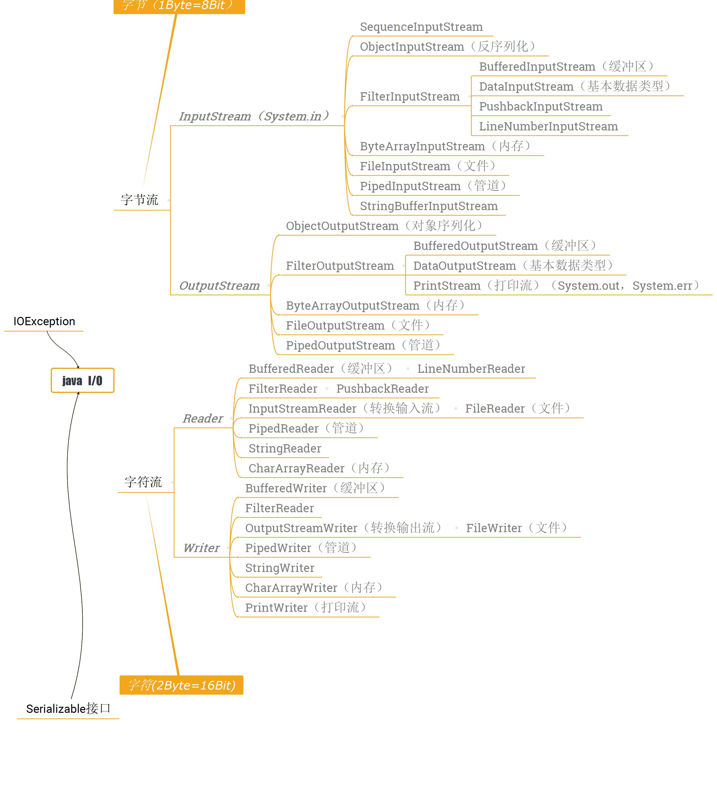

# java.io包代码分析：

所有的IO操作都在java.io包之中进行定义，而且整个java.io包实际上就是五个类和一个接口：
> - 五个类：File、InputStream、OutputStream、Reader、Wirter
> - 一个接口：Serializable

首先，总览整个包的类关系继承图，建立一个概念：

## 一 基本概念：
### 流的概念：
流：流是一组有顺序的，有起点和终点的字节集合，是对数据传输的总称或抽象。
即数据在两设备间的传输称为流，流的本质是数据传输，根据数据传输特性将流抽象为各种类，方便更直观的进行数据操作。 

### IO流的分类：
总体上，根据流的类型和方向，可以分为如下两种情况：
> - 根据处理数据类型的不同分为：字符流和字节流
> - 根据数据流向不同分为：输入流和输出流

两个重点：
线程安全的日志类，并且提高效能；
数据库的事务的支持，使用JDBC和MyBatis等进行事务的处理和回滚操作；

