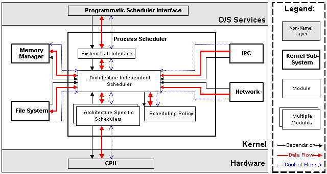

# kernel系统分析

安装系统和日常使用并不能帮助了解kernel，所以想干一件事情的最好办法就是make hands dirty，现在慢慢的开始了解一下和程序使用相关的内容：

## 0 什么是linux内核

（1）内核作为一个操作系统的主体部分，本质在于抽象硬件资源，消除用户和多种硬件之间的差异，提供一种统一的虚拟操作界面，或者称为虚拟机。
>用户看见的计算机就是操作系统提供的虚拟模型，不同的操作系统对虚拟操作界面的观点也是不同的。所以会有各种各样的操作系统，表示了不同的视角和应用场景。

（2）Linux内核，是一种计算机操作系统内核，以C语言和汇编语言写成，符合POSIX标准，以GNU通用公共许可证发布。
从技术上说Linux只是一个内核。“内核”指的是一个提供硬件抽象层、磁盘及文件系统控制、多任务等功能的系统软件。一个内核并不是一套完整的操作系统。有一套基于Linux内核的完整操作系统叫作Linux操作系统，或是GNU/Linux（在该系统中包含了很多GNU计划的系统组件），例如著名的GNU项目提供的GCC编译器等，这两者合起来才能算是一个完整的操作系统。本文主要分析操作系统的内核，并没有考虑工具链等内容。

（3）linux内核提供的抽象虚拟机就是进程，这个和windows下区分的进程和线程是不同的概念。A process (also called a task) is a program in execution; it consists of executable code and dynamic data. The kernel associates enough information with each process to stop and resume it.

>WIN32里的进程/线程是继承自OS/2的。进程和线程的概念都是有着明确定义的，进程的概念对应于一个程序的运行实例(instance)，而线程则是程序代码执行的最小单元。也就是说windows对于进程和线程的定义是与经典OS课程中所教授的进程、线程概念相一致的。对于linux来说，则没有很明确的进程、线程概念。但是linux只有进程而没有线程，然而它的进程又可以表现得像windows下的线程。

>在WIN32里的线程才相当于Linux的进程，是一个实际正在执行的代码。但是，WIN32里同一个进程里各个线程之间是共享数据段的。这才是与Linux的进程最大的不同。

>>windows下，一个典型的线程拥有自己的堆栈、寄存器（包括程序计数器PC，用于指向下一条应该执行的指令在内存中的位置），而代码段、数据段、打开文件这些进程级资源是同一进程内多个线程所共享的。因此同一进程的不同线程可以很方便的通过全局变量（数据段）进行通信，大家都可以对数据段进行读写，这很方便，也被在安全性方面诟病，因为它要求程序员时刻意识到这些数据不是线程独立的。

>linux下的进程不能像windows下线程那样方便地通信，因为他们没有共享数据段、地址空间等。它们之间的通信是通过所谓IPC(InterProcess Communication)来进行的。具体有管道（无名管道用于父子进程间通信，命名管道可以用于任意两个进程间的通信）、共享内存（一个进程向系统申请一块可以被共享的内存，其它进程通过标识符取得这块内存，并将其连接到自己的地址空间中，效果上类似于windows下的多线程间的共享数据段），信号量，套接字。
>>linux利用fork()和exec函数族来操作多线程。fork()函数可以在进程执行的任何阶段被调用，一旦调用，当前进程就被分叉成两个进程——父进程和子进程，两者拥有相同的代码段和暂时相同的数据段（虽然暂时相同，但从分叉开的时刻就是逻辑上的两个数据段了，之所以说是逻辑上的，是因为这里是“写时复制”机制，也就是，除非万不得已有一个进程对数据段进行了写操作，否则系统不去复制数据段，这样达到了负担最小），两者的区别在于fork()函数返回值，对于子进程来说返回为0，对于父进程来说返回的是子进程id，因此可以通过if(fork()==0)…else…来让父子进程执行不同的代码段，从而实现“分叉”。

>>exec函数族的函数的作用则是启动另一个程序的新进程，然后完全用那个进程来代替自己（代码段被替换，数据段和堆栈被废弃，只保留原有进程id）。这样，如果在fork()之后，在子进程代码段里用exec启动另一个进程，就相当于windows下的CreateThread()的用处了，所以说linux下的进程可以表现得像windows下的线程。


## 1 内核的整体结构
一个比较高的高度来审视一下 GNU/Linux 操作系统的体系结构。可以从两个层次上来考虑操作系统：用户层次和内核层次。
（1）用户层次表示linux系统提供给用户使用的各种组件和功能，也是日常使用和程序员编写程序的主要环境；
（2）内核层次表示linux系统本身的运作部分，是沟通底层硬件和用户调用的中间部分，活在内存中的精灵。


Linux 内核可以进一步划分成3层。最上面是系统调用接口，它实现了一些基本的功能，例如 read 和 write。系统调用接口之下是内核代码，可以更精确地定义为独立于体系结构的内核代码。这些代码是 Linux 所支持的所有处理器体系结构所通用的。在这些代码之下是依赖于体系结构的代码，构成了通常称为 BSP（Board Support Package）的部分。这些代码用作给定体系结构的处理器和特定于平台的代码。

### 1.1 内核的层次：
在讨论大型而复杂的系统的体系结构时，可以从很多角度来审视系统。但是一个设计良好的系统一定是层次结构划分明确，高内聚低耦合的系统，可以供不同的开发组关注于各自的部分，分布式开发。
体系结构分析的一个目标是提供一种方法更好地理解源代码，个人比较偏向于首先从底层启动到上层实现的过程来认识一个系统，然后针对实现细节各个详细分析相互之间的关系。
Linux内核就是这样的一个整体，它会将所有操作系统需要提供的基本服务都集成到内核中，所以也称为宏内核。并且通过代码放置在不同的目录下，并且提供统一的模块间接口，整个代码被维护和开发。


如上图所示，整个内核由七个主要模块组成：
>a)        系统调用接口（SCI）：open、read、write等系统调用
b)        进程管理（PM）：创建进程、删除进程、调度进程等
c)        内存管理（MM）：内存分配、管理等
d)        虚拟文件系统（VFS）：为多种文件系统提供统一的操作接口
e)        网络协议栈：提供各种网络协议
f)        CPU架构相关代码（Arch）：为的是提高至移植性
g)        设备驱动程序（DD）：各种设备驱动，占到内核的70%左右代码

其中Arch，DD和SCI为体系结构相关的部分；SCI为系统调用部分完全和体系结构无关，还有中间的其他部分作为内核主体。

这样内核又被整体上分为三个层次：
1. 体系相关部分处理不同处理器架构和开发板相关支持，主要为Arch和DD部分；
2. 体系无关的集中精力处理操作系统内部功能的实现上，中间的四个模块；
3. 操作系统提供的系统服务层次，主要为SCI部分；

通过层次化设计，linux称为支持平台最多的操作系统，并且Linux内的设备驱动程序可以方便地以模块化（modularize）的形式设置，可以再系统运行期间可直接装载或卸载，从而方便多种硬件驱动的移植（这也是android选择linux作为内核的原因）。

### 1.2 内核代码树结构
首先获取linux内核源代码，有两种方式：
（1）获取稳定的内核版本，一般都是通过这种方式获取，访问：www.kernel.org来获取；
（2）获取最新的修改版本，访问https://github.com/torvalds/linux，然后通过：
```shell
git clone https://github.com/torvalds/linux.git
```
来同步最新代码。

然后在内核源代码目录下使用（只有linux系统支持）：
```shell
tree -L 1
```
查看当前linux内核代码的主体层次，以稳定的4.0.1版本为例，结果如下：
```shell
.
|FILES:
|-- COPYING
|-- CREDITS
|-- Kbuild
|-- Kconfig
|-- MAINTAINERS
|-- Makefile
|-- README
|-- REPORTING-BUGS
|DIRS:
|-- Documentation
|-- arch
|-- block
|-- crypto
|-- drivers
|-- firmware
|-- fs
|-- include
|-- init
|-- ipc
|-- kernel
|-- lib
|-- mm
|-- net
|-- samples
|-- scripts
|-- security
|-- sound
|-- tools
|-- usr
`-- virt
```

其中的FILES和DIRS是自己加上的，FILES表示是文件而不是目录:
#### 1.2.1 FILES说明：
配置文件以及声明文件都放在根目录下，这些类型的文件在其他项目中也时常看到：

1. COPYING：关于专利和版权的问题，linux内核采用了GPLv2
2. CREDITS：贡献者
3. Kbuild：内核编译的一个配置脚本，比如支持什么样arch处理器
4. Kconfig：内核配置脚本
5. MAINTAINERS：维护者们的一些信息，如果你发现了漏洞可以和相应模块的维护者联系
6. Makefile：编译内核主要文件，它会向编译器传递参数，比如需要编译的文件
7. README：告诉你编译内核的步骤
8. REPORTING-BUGS：报告错误的帮助文件

#### 1.2.2 DIRS说明：
内核代码按照不同的模块放在不同的目录下，按照内核主要模块的分布为：
```shell
|-- include

|-- arch
|-- drivers
|-- firmware

|-- init

|-- kernel
|-- mm
|-- fs
|-- ipc
|-- net

|-- block
|-- crypto
|-- lib
|-- samples
|-- scripts
|-- security
|-- sound
|-- tools
|-- usr
|-- virt
|-- Documentation
```

1. include：
	这个目录包含了内核中大部分的头文件，它们按照下面的子目录进行分组。
    include/asm-*/，这样的子目录有多个，每一个都对应着一个arch的子目录，比如include/asm-alpha、include/asm-arm、include/asm-i386等。每个子目录中的文件都定义了支持给定体系结构所必须的预处理器宏和内联函数，这些内联函数多数都是全部或部分使用汇编语言实现的。
    编译内核时，系统会建立一个从include/asm目录到目标体系结构特有的目录的符号链接。比如对于arm平台，就是include/asm-arm到include/asm的符号链接。因此，体系结构无关部分的内核代码可以使用如下形式包含体系相关部分的头文件。
    ```shell
    #include <asm/some-file>
	```
    include/linux/，与平台无关的头文件都在这个目录下面，它通常会被链接到目录/usr/include/linux（或者它里面的所有文件会被复制到/usr/include/linux目录下面）。因此用户应用程序里和内核代码里的语句：
    ```shell
    #include <linux/some-file>
	```
    包含的头文件的内容是一致的。
    include目录下的其他子目录，在此不做赘述。

2. arch：所有与体系结构相关的代码都在这个目录以及include/asm-*/目录中，Linux支持的每种体系结构在arch目录下都有对应的子目录，而在每个体系结构特有的子目录下又至少包含3个子目录。
	（1）kernel：存放支持体系结构特有的诸如信号量处理和SMP之类特征的实现。
    （2）lib：存放体系结构特有的对诸如strlen和memcpy之类的通用函数的实现，从而达到高效率低开销的实现。
    （3）mm：存放体系结构特有的内存管理程序的实现，包括内存初始化，页表管理等内容。
	除了这3个子目录之外，大多数体系结构在必要的情况下还有一个boot子目录：
    （4）boot：
    包含当前体系结构上系统引导过程使用的部分或全部代码，完成向特定平台系统内存加载内核镜像的工作。此外，大部分体系结构所特有的子目录还根据需要包含了供附加特性使用的其他子目录。比如，i386目录包含一个math-emu子目录，其中包括了在缺少数学协处理器（FPU）的CPU上运行模拟FPU的代码。

3. drivers：
	这个目录包含系统中所有的设备驱动程序。不同的目录表示不同的硬件设备，它又进一步划分成三类设备驱动：字符模块, 块模块, 或者一个网络模块。每一种有对应的子目录。
    驱动程序指的是控制某一系列硬件的软件程序。比如说，为了使计算机能够理解键盘的输入并使键盘可以使用，我们需要一个键盘驱动程序。这个目录中存在很多子目录。每个子目录都以每个系列的硬件命名。比如，名为bluetooth的目录保存有蓝牙驱动程序的代码。其它的还有scsi,usb,firewire等等。一些驱动程序可能会比较难找。比如joystick驱动程序并没有在joystick目录中，它们保存在./drivers/input/joystick中。键盘和鼠标的驱动程序也保存在input目录中。子目录中，名为Macintosh的目录包含了苹果公司制作的硬件的驱动程序代码。xen目录包含Xen hypervisor的驱动程序hypervisor是一种允许用户在单台计算机上运行多个操作系统的软件或硬件。也就是说，xen代码允许用户在同一个机器上同时运行两个或更多的linux操作系统。用户也可以在linux系统上运行windows, Solaris, FreeBSD或其它的系统系统。在drivers目录中还有很多的子目录以至于无法在这里详尽描述，不过在以后的文章中会逐步提到。
	这个目录是内核中最庞大的一个目录，显卡、网卡、SCSI适配器、PCI总线、USB总线和其他任何Linux支持的外围设备或总线的驱动程序都可以在这里找到。

4. firmware：
	firmware目录包含了允许计算机读取和理解设备信号的文件。比如，摄像头管理它自己的硬件，而计算机必须理解摄像头发送给计算机的信号。linux系统使用vicam firmware去理解摄像头发送的信号。如果没有firmware，linux系统将不知道如何处理摄像头发送的信息。而且，firmware也帮助linux系统发送信息给设备。linux系统可以通过这种方法控制摄像头的对焦或关闭。
    主要为ihex和hex文件：
    Hex 全称Intel HEX（ihex）文件是由一行行符合Intel HEX文件格式的文本所构成的ASCII文本文件。在Intel HEX文件中，每一行包含一个HEX记录。这些记录由对应机器语言码和/或常量数据的十六进制编码数字组成。Intel HEX文件通常用于传输将被存于ROM或者EPROM中的程序和数据。大多数EPROM编程器或模拟器使用Intel HEX文件。
    参考：
    http://blog.csdn.net/lanmanck/article/details/5099354
    http://blog.csdn.net/flydream0/article/details/8447087
>关于drivers和firmware的关系：两者都是代码，前者为软件服务，后者为硬件服务。
在Linux Kernel中，Driver和Firmware是有明确含义的，其中Driver是控制被操作系统管理的外部设备（Device）的代码段。很多时候Driver会被实现为LKM，但这不是必要条件。driver通过driver_register()注册到总线(bus_type）上，代表系统具备了驱动某种设备（device）的能力。当某个device被注册到同样的总线的时候（通常是总线枚举的时候发现了这个设备），总线驱动会对driver和device会通过一定的策略进行binding（即进行匹配），如果Binding成功，总线驱动会调用driver的probe()函数，把设备的信息（例如端口，中断号等）传递给驱动，驱动就可以对真实的物理部件进行初始化，并把对该设备的控制接口注册到Linux的其他子系统上（例如字符设备，v4l2子系统等）。这样操作系统的其他部分就可以通过这些通用的接口来访问设备了。
而Firmware，是表示运行在非“控制处理器”（指不直接运行操作系统的处理器，例如外设中的处理器，或者被用于bare metal的主处理器的其中一些核)中的程序。这些程序很多时候使用和操作系统所运行的处理器完全不同的指令集。这些程序以二进制形式存在于Linux内核的源代码树中，生成目标系统的时候，通常拷贝在/lib/firmware目录下。当driver对device进行初始化的时候，通过request_firmware()等接口，在一个用户态helper程序的帮助下，可以把指定的firmware加载到内存中，由驱动传输到指定的设备上。
所以，总的来说，其实driver和firmware没有什么直接的关系，但firmware通常由驱动去加载。我们讨论的那个OS，一般不需要理解firmware是什么，只是把它当做数据。firmware是什么，只有使用这些数据的那个设备才知道。好比你用一个电话，电话中有一个软件，这个软件你完全不关心如何工作的，你换这个软件的时候，就可以叫这个软件是“固件”，但如果你用了一个智能手机，你要细细关系什么是上面的应用程序，Android平台，插件之类的细节内容，你可能就不叫这个东西叫“固件”了。
为什么不把fimware做的很完美，做的不需要驱动支持呢？因为有不同的操作系统，硬件厂商希望自己的硬件能被更多的软件厂商使用，不同的操作系统，对于操作硬件的方式完全不同，在Windows里应用态是无法直接写IO端口的，而在嵌入式系统里，一般都不限制直接操作IO端口。所以，硬件厂商一方面为了自己的硬件能被软件更简单的使用，就需要写firmware，而另一方面为了兼容各种操作系统，又不能把firmware写的太死，必须预留足够的余地让软件自由发挥——软件的自由发挥就是驱动，所以就需要在硬件之上做一些封装，让自己的硬件操纵起来更容易，它简化了软件与硬件的交互。这就是驱动存在的意义——适应系统需要。
来源：http://www.zhihu.com/question/22175660

5. init：
	内核的初始化代码。包括main.c、创建早期用户空间的代码以及其他初始化代码。内核初始化入口函数start_kernel就在该目录的main.c文件中。

6. kernel：
	内核中最核心的部分，包括进程的调度（kernel/sched.c），以及进程的创建和撤销（kernel/fork.c和kernel/exit.c）等，该目录代码实现了这些核心模块的主体框架，独立于具体的平台和体系结构。和平台相关的另外一部分核心的代码在arch/*/kernel目录。

7. mm：
	包含了体系结构无关部分的内存管理代码，体系相关的部分位于arch/*/mm目录下。

8. fs：
	虚拟文件系统（VFS，Virtual File System）的代码，和各个不同文件系统的代码都在这个目录中。Linux支持的所有文件系统在fs目录下面都有一个对应的子目录。比如ext2文件系统对应的是fs/ext2目录。
    一个文件系统是存储设备和需要访问存储设备的进程之间的媒介。存储设备可能是本地的物理上可访问的，比如硬盘或CD-ROM驱动器，它们分别使用ext2/ext3和isofs文件系统；也可能是通过网络访问的，使用NFS文件系统。
    还有一些虚拟文件系统，比如proc，它以一个标准文件系统出现，然而，它其中的文件只存在于内存中，并不占用磁盘空间。

9. ipc：
	IPC，即进程间通信（interprocess communication）。它包含了共享内存、信号量以及其他形式IPC的代码。

10. net：
	网络相关代码，实现了各种常见的网络协议，如TCP/IP、IPX等。

11. block：
block层的实现。最初block层的代码一部分位于drivers目录，一部分位于fs目录，从2.6.15开始，block层的核心代码被提取出来放在了顶层的block目录。

12. crypto：
内核本身所用的加密API，实现了常用的加密和散列算法，还有一些压缩和CRC校验算法。

13. lib：
库代码，实现了一个标准C库的通用子集，包括字符串和内存操作的函数（strlen、mmcpy和其他类似的函数）以及有关sprintf和atoi的系列函数。与arch/lib下的代码不同，这里的库代码都是使用C编写的，在内核新的移植版本
中可以直接使用。
14. samples：
里面包含一些编程实例和模块。

15. scripts：
该目录中不包含任何核心代码
该目录存放用来配置内核的脚本和应用程序源码
当输入make menuconfig或make xconfig等命令进行内核配置时，会读取当前体系结构的Kconfig进行配置，配置完成后会在内核根目录中生成.config文件。

16. security：
这个目录包括了不同的Linux安全模型的代码，比如NSA Security-Enhanced Linux。

17. sound：
声卡驱动以及其他声音相关的代码。（声卡为什么没有作为一般的驱动进行处理？）

18. tools：
包含影响内核的工具。

19. usr：
实现了用于打包和压缩的的cpio等。

20. virt：
虚拟化，允许使用者运行不同的操作系统，与Xen不同的是，宾客系统就像一个应用程序一样运行在linxu操作系统最上层。而Xen是让两个操作系统共同管理硬件，互不依赖。

21. Documentation：
这个目录下面没有内核代码，只有很多质量参差不齐的文档，但往往能够给我们提供很多的帮助。

### 1.3 内核的主要概念
操作系统的出现就是为了提供一个稳定安全的软件执行环境，所以操作系统需要和用户程序产生某种隔离来保证操作系统本身的稳定性和安全性，并且操作系统要能够完整的将硬件资源提供给用户使用。
以X86架构来说：
>（1）为了提供所有的硬件资源，需要用某一种机制来代理资源，“文件”和“进程”就是Linux内核中的两个最基本实体和中心概念，Linux系统的所有操作都是以这两者为基础的
>（2）并且CPU提供了ring级别来保证隔离，所以内核处于ring0，而用户程序处于ring3。通过用户程序向内核发出系统调用这一特殊中断，随后包含该程序的进程又用户态进入内核态，就可以访问内核提供的功能了；

上述两个就是需要了解的基本概念。

### 1.4 内核主体部分的模块划分

我们主要分析的内核实现的主体部分，尽量去除完全体系相关的Arch部分和上层系统调用SCI部分来进行分析。那么整体上，内核由以下五个部分组成：


各个模块分别负责如下的功能：
1. Process Scheduler，也称作进程管理、进程调度。负责管理CPU资源，以便让各个进程可以以尽量公平的方式访问CPU。
2. Memory Manager，内存管理。负责管理Memory（内存）资源，以便让各个进程可以安全地共享机器的内存资源。另外，内存管理会提供虚拟内存的机制，该机制可以让进程使用多于系统可用Memory的内存，不用的内存会通过文件系统保存在外部非易失存储器中，需要使用的时候，再取回到内存中。
3. VFS（Virtual File System），虚拟文件系统。Linux内核将不同功能的外部设备，例如Disk设备（硬盘、磁盘、NAND Flash、Nor Flash等）、输入输出设备、显示设备等等，抽象为可以通过统一的文件操作接口（open、close、read、write等）来访问。这就是Linux系统“一切皆是文件”的体现（其实Linux做的并不彻底，因为CPU、内存、网络等还不是文件，如果真的需要一切皆是文件，还得看贝尔实验室正在开发的"Plan 9”的）。
4. Network，网络子系统。负责管理系统的网络设备，并实现多种多样的网络标准。
5. IPC（Inter-Process Communication），进程间通信。IPC不管理任何的硬件，它主要负责Linux系统中进程之间的通信。

可以看出这五个主要模块的相互关系如下：
进程调度子系统是内核的核心子系统：其它子系统都对进程调度子系统有依赖，因为其它子系统都有暂停（suspend）和恢复（resume）进程的功能需要。通常，某子系统会在等待硬件操作而暂停进程，尔后在操作完成后恢复进程。例如，当进程发一条网络消息后，网络接口可能需要暂停进程，直到硬件成功地完成信息的发送。在消息被发出后，网络接口返回一个代码表示操作的成功与否，然后恢复进程。其它子系统（内存管理子系统、虚拟文件系统、进程互通信子系统）都有类似的原因而依赖于进程调度子系统。

（1）进程调度与内存管理 ：进程调度子系统[使用]内存管理子系统来调整进程的物理内存映射表，这个调整动作发生进程被恢复时。（KEMIN:陈莉君的《深入分析 Linux内核源代码》里说进程调度依赖内存管理在于“在多道程序环境下，程序要运行必须为之创建进程，而创建进程的第一件事，就是要将程序和数据装入内存”，这就要看进程创建是不是进程调度的功能了。）

（2）进程互通信与内存管理 ：进程互通信子系统依赖内存管理实现共享内存互通信机制，这种机制允许两个进程除了访问自己的私有内存外，还可访问一段共同的内存区域。

（3）虚拟文件系统与网络接口 ：虚拟文件系统[利用]网络接口实现网络文件系统（NFS），也利用内存管理子系统实现RAMDISK设备。

（4）内存管理与虚拟文件系统 ：内存管理子系统利用虚拟文件系统实现对换机制（swapping），这也是内存管理子系统依赖于进程调度的唯一原因。当一个进程读取的内存页被换出（swapped out）时，内存管理向文件系统发出请求，同时，挂起当前正在运行的进程。

因此，操作系统主要集中在抽象和调度上，和一般的程序的核心其实没有什么不同，合理的抽象和满足实际需求的调度是基本要求。所以不要害怕内核什么，但是也不要轻视（毕竟国内目前都没有实际成熟的内核实现）。

#### 1.4.1 进程调度子模块说明：
##### 1.4.1.1 主要功能
进程调度子系统负责控制对CPU的访问，包括来自用户进程的访问和内核其它子系统的访问。
##### 1.4.1.2 内部模块组成
进程调度子系由四个主要的模块组成：


1. Scheduling Policy，实现进程调度的策略，它决定哪个（或哪几个）进程将拥有CPU。
2. Architecture-specific Schedulers，体系结构相关的部分，用于将对不同CPU的控制，抽象为统一的接口。这些控制主要在suspend和resume进程时使用，牵涉到CPU的寄存器访问、汇编指令操作等。
3. Architecture-independent Scheduler，体系结构无关的部分。它会和“Scheduling Policy模块”沟通，决定接下来要执行哪个进程，然后通过“Architecture-specific Schedulers模块”resume指定的进程。
4. System Call Interface，系统调用接口。进程调度子系统通过系统调用接口，将需要提供给用户空间的接口开放出去，同时屏蔽掉不需要用户空间程序关心的细节。

##### 1.4.1.3 主要数据结构
整体上，调度程序负责maintains一个数据结构——任务列表（task list），每个活动的进程对应列表上的一项。这个数据结构包含了进程暂停和恢复的足够信息；此外还有一些日志和账户管理信息。这个数据在整个内核层都是可见的。
##### 1.4.1.4 数据流，控制流和依赖关系
前面提到，进程调度子系统对内存管理子系统是有依赖的。而其它子系统因为某些操作而需要暂停当前进程而依赖于进程调度子系统。依赖的体现是子系统间的函数调用和对任务列表（task list）的共享访问。对任务列表（也就是进程控制块）可读可写的的子系统与进程调度子系统间有双向的（bi-directional）数据流。

除了内核层存在数据和控制流外，系统服务层（O/S services）为用户进程提供了注册（register）定时通知（timer notification）的接口，这就是[《An Introduction to Software Architecture 》](http://www.cs.cmu.edu/afs/cs/project/vit/ftp/pdf/intro_softarch.pdf)提到过的[隐式调用风格]。通过隐式调用，调度程序可以把控制流反转回进程，当有通知事件直接调用用户进程（的注册处理函数）。一般认为唤醒睡眠状态的进程的动作不算是一种控制流，因为用户不能检测到这个操作。最后，调度程序与CPU通信，暂停和恢复进程运行，这个动作有数据流和控制流进出两子系统。

#### 1.4.2 内存管理子模块说明：

##### 1.4.2.1 主要功能
内存管理子系统负责控制进程对硬件内存资源的访问。这个任务可能需要硬件机构（比如MMU）辅助来实现进程逻辑地址到机器物理地址的映射。这个映射是基于每个进程的，所以每个进程都拥有属于自己的逻辑地址空间。此外，内存管理子系统实现了对换机制，负责将暂时不使用的内存页转移到外存。

##### 1.4.2.2 内部模块组成
内存管理子系统由三个模块组成：


1. 体系相关模块：与进度管理子系统的体系相关模块功能类似，对硬件体系抽象一些虚拟接口；
2. 体系无关模块：本模块执行所有地址映射和虚拟内存对换，负责包括决定当产生缺页事件时哪个内存页将被替换。与进程调度子系统不同，本子系统没有另外的替换策略模块，因为替换很少很更改，没有必须独立出来产生不必要的性能损耗。
3. 系统调用模块为用户进程提供有限的访问接口。用户进程可以通过这个接口进行存储分配和释放，还可以执行内存映射文件I/O。

##### 1.4.2.3 主要数据结构
内存管理子系统为每个进程维护一张地址映射表。这张映射表的首地址被保存到该进程的进程控制块（[task_struct结构体中](http://lxr.linux.no/linux-old+v2.4.31/include/linux/sched.h#L283)），以作关联。此外，为了实现内存页调度，映射表还要提供关于页调度信息。最后，为了安全性，映射表还要有权限和账户信息。
##### 1.4.2.4 数据流，控制流和依赖关系
内存管理子系统负责控制内存硬件，并对当产生缺页事件时接收并处理这个事件。所以，在内存管理子系统和内存硬件之间有双向的数据和控制流。另外，内存管理子系统[利用]文件系统实现对换和[内存映射I/O]。具体内存管理子系统通过函数调用，调用文件系统，实现页面替换或对换。由于文件I/O相对较慢，内存管理子系统得先暂停当前进程，这个功能产生了一个对进程调度子系统的调用依赖。又因为每个进程的内存映射表都是保存到进程调度程序的数据结构的，所以在内存管理子系统和进程调度程序之间有双向的数据流。

#### 1.4.3 虚拟文件系统子模块说明：
##### 1.4.3.1 主要功能
虚拟文件系统设计的目的是为了给计算机输入输出操作（包括磁盘数据和其它硬件设备操作）一个一致的视图。几乎所有计算机硬件设备都是通过一个通用的设备驱动接口（generic device driver interface）连接入主机。虚拟文件系统则走得更远，透过虚拟文件系统，系统管理员可以把任何物理设备上的任何逻辑文件系统挂接（mount）入主机。逻辑文件系统提高了各操作系统标准的兼容性，容许开发人员使用不同的策略实现文件系统。虚拟文件系统通过抽象既隐藏了物理设备的细节，也隐藏了逻辑文件系统的特殊细节，用户进程可使用一个通用的接口访问文件数据，而不必知道这些数据到底是在物理设备还是在逻辑设备上。
除了一般文件系统的功能目标外，虚拟文件系统也负责加载可执行程序。逻辑文件系统模块负责实现这个功能，有了它，Linux可支持多种可执行文件格式。
##### 1.4.3.2 内部模块组成
虚拟文件系统主要由五个子模块组成：


1. Device Drivers，设备驱动，用于控制所有的外部设备及控制器。由于存在大量不能相互兼容的硬件设备（特别是嵌入式产品），所以也有非常多的设备驱动。因此，Linux内核中将近一半的Source Code都是设备驱动，大多数的Linux底层工程师（特别是国内的企业）都是在编写或者维护设备驱动，而无暇估计其它内容（它们恰恰是Linux内核的精髓所在）。
2. Device Independent Interface， 该模块定义了描述硬件设备的统一方式（统一设备模型），所有的设备驱动都遵守这个定义，可以降低开发的难度。同时可以用一致的形势向上提供接口。
3. Logical Systems，每一种文件系统，都会对应一个Logical System（逻辑文件系统），它会实现具体的文件系统逻辑。
4. System Independent Interface，该模块负责以统一的接口（快设备和字符设备）表示硬件设备和逻辑文件系统，这样上层软件就不再关心具体的硬件形态了。
5. System Call Interface，系统调用接口，向用户空间提供访问文件系统和硬件设备的统一的接口。

##### 1.4.3.3 主要数据结构
所有文件都通过一个叫i-nodes的数据结构来表征。i-node结构内有文件数据块在物理设备内的位置信息。此外，i-node还保存有指向[逻辑文件系统模块]的函数和设备驱动的函数。通过这种保存函数指针的方式，逻辑文件系统和设备驱动可以把自己注册到内核，内核对这些模块没有依赖，从而变得很灵活。
##### 1.4.3.4 数据流，控制流和依赖关系
虚拟磁盘（ramdisk）是一种特殊的外存设备，它的驱动程序需要内存管理子系统协助实现。因此，[设备驱动模块组]对内存管理子系统有依赖，也有控制流和数据流。
网络文件系统是一种特殊的文件系统。这个文件系统的文件不在本地，网络文件系统（NFS）的[逻辑文件系统]模块利用网络子系统实现功能。因此，在[逻辑文件系统组]与网络子系统之有依赖、控制流和数据流。
虚拟文件系统与进程调度子系统间有依赖前面已经说了，这里具体依赖的模块是虚拟文件系统内的[系统无关接口]。
最后，系统调用接口为用户进程提供了保存和读取文件数据的功能。和前面的子系统不同，虚拟文件系统没有为用户进程提供隐式调用机制，因此，没有由虚拟文件系统到用户进程的控制流。

#### 1.4.4  网络子系统说明：
##### 1.4.4.1 主要功能
网络子系统在Linux内核中主要负责管理各种网络设备，并实现各种网络协议栈，最终实现通过网络连接其它系统的功能。在Linux内核中，网络子系统几乎是自成体系。
##### 1.4.4.2 内部模块组成
包括5个子模块，它们的功能如下：


1. Network Device Drivers，网络设备的驱动，和VFS子系统中的设备驱动是一样的。
2. Device Independent Interface，和VFS子系统中的是一样的。
3. Network Protocols，实现各种网络传输协议，例如IP, TCP, UDP等等。
4. Protocol Independent Interface，屏蔽不同的硬件设备和网络协议，以相同的格式提供接口（socket)。
5. System Call interface，系统调用接口，向用户空间提供访问网络设备的统一的接口。

##### 1.4.4.3 主要数据结构
每个网络对象通过一个叫套接字（socket）的数据结构表征。Socket用与i-node类似的方式关联到进程（控制块）。
##### 1.4.4.4 数据流，控制流和依赖关系
因为网络操作较慢，网络子系统与进程调度子有依赖。此外，为了协助虚拟文件系统实现[网络文件系统]（NFS），两子系统间有依赖。

#### 1.4.5 进程间通信子模块

