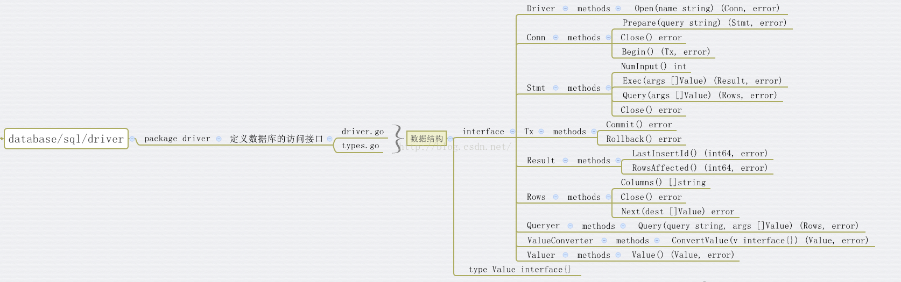
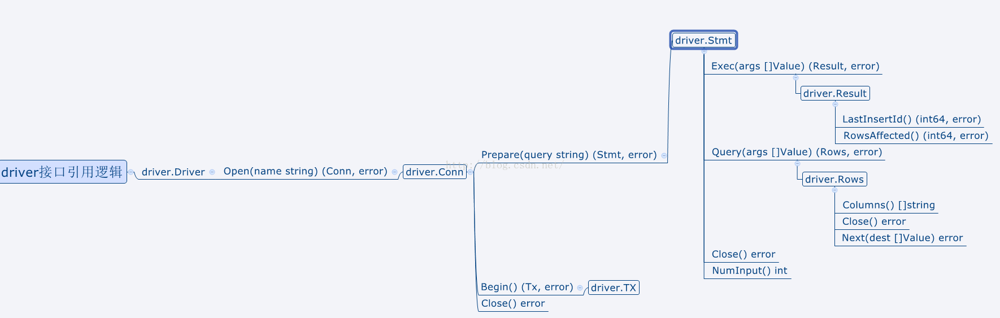

<!-- TOC -->

- [golang的数据库编程](#golang的数据库编程)
    - [golang的数据库设计：](#golang的数据库设计)
        - [数据库底层驱动接口定义：driver.go](#数据库底层驱动接口定义drivergo)
            - [数据库驱动接口：driver.Driver](#数据库驱动接口driverdriver)
            - [数据库链接接口定义：driver.Conn](#数据库链接接口定义driverconn)
            - [数据库链接的预处理：driver.Stmt](#数据库链接的预处理driverstmt)
            - [数据库的事务（transaction）：drivers.Tx](#数据库的事务transactiondriverstx)
            - [数据库的预处理执行：drivers.Execer](#数据库的预处理执行driversexecer)
            - [数据库的执行结果：driver.Result](#数据库的执行结果driverresult)
            - [数据库查询结果集：driver.Rows](#数据库查询结果集driverrows)
            - [数据库查询结果的另一种表示：driver.RowsAffected](#数据库查询结果的另一种表示driverrowsaffected)
            - [数据库操作值接口：drivers.Value](#数据库操作值接口driversvalue)
            - [数据库值转换：driver.ValueConverter](#数据库值转换drivervalueconverter)
            - [获取Value的接口：driver.Valuer](#获取value的接口drivervaluer)
        - [数据库上层应用层接口：sql.go](#数据库上层应用层接口sqlgo)
            - [内部数据结构：sql.DB](#内部数据结构sqldb)
            - [注册数据库驱动：func Register(name string, driver driver.Driver)](#注册数据库驱动func-registername-string-driver-driverdriver)
            - [Statement数据结构：sql.Stmt](#statement数据结构sqlstmt)
    - [golang的MySQL开发使用：](#golang的mysql开发使用)
        - [驱动支持：](#驱动支持)
        - [建表SQL：](#建表sql)
        - [测试样例：](#测试样例)
    - [golang的SQLite开发使用：](#golang的sqlite开发使用)
        - [驱动支持：](#驱动支持-1)
        - [建表SQL：](#建表sql-1)
        - [样例代码：](#样例代码)

<!-- /TOC -->


# golang的数据库编程
熟悉了web页面的开发，还需要结合数据库操作才能贴近真实的开发流程。因为对许多Web应用程序而言，数据库都是其核心所在。
Go没有内置的驱动支持任何的数据库，但是Go定义了database/sql接口，用户可以基于驱动接口开发相应数据库的驱动。
参考教程：[Go database/sql tutorial](http://go-database-sql.org/index.html)


## golang的数据库设计：
Go与PHP不同的地方是Go官方没有提供数据库驱动，而是为开发数据库驱动定义了一些标准接口，开发者可以根据定义的接口来开发相应的数据库驱动，这样做有一个好处，只要是按照标准接口开发的代码， 以后需要迁移数据库时，不需要任何修改。
首先看看sql的包位于 C:\Go\src\database\sql\ 这个文件夹下，包含了一下文件：
```shell
│  convert.go
│  convert_test.go
│  ctxutil.go
│  doc.txt
│  example_test.go
│  fakedb_test.go
│  sql.go
│  sql_test.go
│
└─driver
        driver.go
        types.go
        types_test.go
```
在内部定义接口中，分为底层驱动接口和上层数据库应用接口两种，而且驱动层实现的接口和应用层的调用接口几乎一模一样，这样就使应用程序调用者和驱动的实现者看到的接口视角的一致性。
则也算一种编程哲学：增强功能但是调用接口不变，一般的理解是增强功能要增加接口，但是sql包的实现几乎没有增加太多的调用接口而实现功能增强。

sql包的实现者教科书般的告诉我们实现抽象型平台型中间件的方法：
> - 1. 抽象底层实现者接口
> - 2. 中间件面向接口层实现平台级层逻辑
> - 3. 对外提供一套统一的调用API，隔离底层实现者和上层调用者


### 数据库底层驱动接口定义：driver.go
位于：c:\go\src\database\sql\driver\driver.go
这个包中定义了数据库驱动需要实现的一组接口，不同的数据库对这组接口进行实现来提供对应的驱动，供开发人员使用。
通过对驱动层定义一个标准接口层，实现了：
> - 1. 隔离具体的数据库
> - 2. 各个具体的数据库驱动实现该套接口即可被使用
> - 3. 应用层调用逻辑不依赖具体的数据库，其使用的是上层应用接口，也就是sql提供的标准API

底层驱动层的实现特点：
> - 1. 驱动层设计很简单，没有并发锁的控制
> - 2. 驱动层的设计是基于单个连接的，没有考虑连接池
> - 3. 驱动层事务Tx和Stmt是独立分离的，Tx只有两个简单的方法就是Commit() 和Rollback()
> - 4. 驱动的具体实现者只需要在单个连接上实现驱动层的API接口即可

整体上驱动层的数据结构有：
驱动层内部的调用关系：

#### 数据库驱动接口：driver.Driver
Driver是一个数据库驱动的接口，他定义了一个method： Open(name string)，这个方法返回一个数据库的Conn接口。
```golang
// Driver is the interface that must be implemented by a database
// driver.
type Driver interface {
	// Open returns a new connection to the database.
	// The name is a string in a driver-specific format.
	//
	// Open may return a cached connection (one previously
	// closed), but doing so is unnecessary; the sql package
	// maintains a pool of idle connections for efficient re-use.
	//
	// The returned connection is only used by one goroutine at a
	// time.
	Open(name string) (Conn, error)
}
```
返回的Conn只能用来进行一次goroutine的操作，也就是说不能把这个Conn应用于Go的多个goroutine里面。如下代码会出现错误：
```golang
...
go goroutineA (Conn)  //执行查询操作
go goroutineB (Conn)  //执行插入操作
...
```
上面这样的代码可能会使Go不知道某个操作究竟是由哪个goroutine发起的,从而导致数据混乱，比如可能会把goroutineA里面执行的查询操作的结果返回给goroutineB从而使B错误地把此结果当成自己执行的插入数据。

第三方驱动都会定义这个函数，它会解析name参数来获取相关数据库的连接信息，解析完成后，它将使用此信息来初始化一个Conn并返回它。

#### 数据库链接接口定义：driver.Conn
Conn是一个数据库连接的接口定义，他定义了一系列方法，这个Conn只能应用在一个goroutine里面，不能使用在多个goroutine里面：
```golang
// Conn is a connection to a database. It is not used concurrently
// by multiple goroutines.
//
// Conn is assumed to be stateful.
type Conn interface {
	// Prepare returns a prepared statement, bound to this connection.
	Prepare(query string) (Stmt, error)

	// Close invalidates and potentially stops any current
	// prepared statements and transactions, marking this
	// connection as no longer in use.
	//
	// Because the sql package maintains a free pool of
	// connections and only calls Close when there's a surplus of
	// idle connections, it shouldn't be necessary for drivers to
	// do their own connection caching.
	Close() error

	// Begin starts and returns a new transaction.
	//
	// Deprecated: Drivers should implement ConnBeginTx instead (or additionally).
	Begin() (Tx, error)
}
```
Prepare函数返回与当前连接相关的执行Sql语句的准备状态，可以进行查询、删除等操作。

Close函数关闭当前的连接，执行释放连接拥有的资源等清理工作。因为驱动实现了database/sql里面建议的conn pool，所以你不用再去实现缓存conn之类的，这样会容易引起问题。

Begin函数返回一个代表事务处理的Tx，通过它你可以进行查询,更新等操作，或者对事务进行回滚、递交。

#### 数据库链接的预处理：driver.Stmt
Stmt是一种准备好的状态，和Conn相关联，而且只能应用于一个goroutine中，不能应用于多个goroutine。
```golang
// Stmt is a prepared statement. It is bound to a Conn and not
// used by multiple goroutines concurrently.
type Stmt interface {
	// Close closes the statement.
	//
	// As of Go 1.1, a Stmt will not be closed if it's in use
	// by any queries.
	Close() error

	// NumInput returns the number of placeholder parameters.
	//
	// If NumInput returns >= 0, the sql package will sanity check
	// argument counts from callers and return errors to the caller
	// before the statement's Exec or Query methods are called.
	//
	// NumInput may also return -1, if the driver doesn't know
	// its number of placeholders. In that case, the sql package
	// will not sanity check Exec or Query argument counts.
	NumInput() int

	// Exec executes a query that doesn't return rows, such
	// as an INSERT or UPDATE.
	//
	// Deprecated: Drivers should implement StmtExecContext instead (or additionally).
	Exec(args []Value) (Result, error)

	// Query executes a query that may return rows, such as a
	// SELECT.
	//
	// Deprecated: Drivers should implement StmtQueryContext instead (or additionally).
	Query(args []Value) (Rows, error)
}
```
Close函数关闭当前的链接状态，但是如果当前正在执行query，query还是有效返回rows数据。

NumInput函数返回当前预留参数的个数，当返回>=0时数据库驱动就会智能检查调用者的参数。当数据库驱动包不知道预留参数的时候，返回-1。

Exec函数执行Prepare准备好的sql，传入参数执行update/insert等操作，返回Result数据

Query函数执行Prepare准备好的sql，传入需要的参数执行select操作，返回Rows结果集

#### 数据库的事务（transaction）：drivers.Tx
事务处理一般就两个过程，递交或者回滚。数据库驱动里面也只需要实现这两个函数就可以
```golang
// Tx is a transaction.
type Tx interface {
	Commit() error
	Rollback() error
}
```

#### 数据库的预处理执行：drivers.Execer
这是一个Conn可选择实现的接口，并且已经被废弃了。
> 关于Deprecation的godoc注释，可以参考：
> 原文：[Deprecation notices in Go](https://rakyll.org/deprecated/)
> 译文：[Golang中使用『弃用(Deprecate)』](http://blog.cyeam.com/golang/2016/12/12/deprecating-tings-in-go)

```golang
// Execer is an optional interface that may be implemented by a Conn.
//
// If a Conn does not implement Execer, the sql package's DB.Exec will
// first prepare a query, execute the statement, and then close the
// statement.
//
// Exec may return ErrSkip.
//
// Deprecated: Drivers should implement ExecerContext instead (or additionally).
type Execer interface {
	Exec(query string, args []Value) (Result, error)
}
```
如果这个接口没有定义，那么在调用DB.Exec,就会首先调用Prepare返回Stmt，然后执行Stmt的Exec，然后关闭Stmt。

#### 数据库的执行结果：driver.Result
这个是执行Update/Insert等操作返回的结果接口定义：
```golang
// Result is the result of a query execution.
type Result interface {
	// LastInsertId returns the database's auto-generated ID
	// after, for example, an INSERT into a table with primary
	// key.
	LastInsertId() (int64, error)

	// RowsAffected returns the number of rows affected by the
	// query.
	RowsAffected() (int64, error)
}
```
LastInsertId函数返回由数据库执行插入操作得到的自增ID号。

RowsAffected函数返回query操作影响的数据条目数。

#### 数据库查询结果集：driver.Rows
Rows是执行查询返回的结果集接口定义：
```golang
// Rows is an iterator over an executed query's results.
type Rows interface {
	// Columns returns the names of the columns. The number of
	// columns of the result is inferred from the length of the
	// slice. If a particular column name isn't known, an empty
	// string should be returned for that entry.
	Columns() []string

	// Close closes the rows iterator.
	Close() error

	// Next is called to populate the next row of data into
	// the provided slice. The provided slice will be the same
	// size as the Columns() are wide.
	//
	// Next should return io.EOF when there are no more rows.
	Next(dest []Value) error
}
```
Columns函数返回查询数据库表的字段信息，这个返回的slice和sql查询的字段一一对应，而不是返回整个表的所有字段。

Close函数用来关闭Rows迭代器。

Next函数用来返回下一条数据，把数据赋值给dest。dest里面的元素必须是driver.Value的值除了string，返回的数据里面所有的string都必须要转换成[]byte。如果最后没数据了，Next函数最后返回io.EOF。

#### 数据库查询结果的另一种表示：driver.RowsAffected
RowsAffected其实就是一个int64的别名，但是他实现了Result接口，用来底层实现Result的表示方式：
```golang
// RowsAffected implements Result for an INSERT or UPDATE operation
// which mutates a number of rows.
type RowsAffected int64

var _ Result = RowsAffected(0)

func (RowsAffected) LastInsertId() (int64, error) {
	return 0, errors.New("no LastInsertId available")
}

func (v RowsAffected) RowsAffected() (int64, error) {
	return int64(v), nil
}
```

#### 数据库操作值接口：drivers.Value
Value其实就是一个空接口，他可以容纳任何的数据:
```golang
// Value is a value that drivers must be able to handle.
// It is either nil or an instance of one of these types:
//
//   int64
//   float64
//   bool
//   []byte
//   string
//   time.Time
type Value interface{}
```
drive的Value是驱动必须能够操作的Value，Value要么是nil，要么是下面的任意一种：
```shell
int64
float64
bool
[]byte
string   [*]除了Rows.Next返回的不能是string.
time.Time
```

#### 数据库值转换：driver.ValueConverter
ValueConverter接口定义了如何把一个普通的值转化成driver.Value的接口：
```golang
// ValueConverter is the interface providing the ConvertValue method.
//
// Various implementations of ValueConverter are provided by the
// driver package to provide consistent implementations of conversions
// between drivers. The ValueConverters have several uses:
//
//  * converting from the Value types as provided by the sql package
//    into a database table's specific column type and making sure it
//    fits, such as making sure a particular int64 fits in a
//    table's uint16 column.
//
//  * converting a value as given from the database into one of the
//    driver Value types.
//
//  * by the sql package, for converting from a driver's Value type
//    to a user's type in a scan.
type ValueConverter interface {
	// ConvertValue converts a value to a driver Value.
	ConvertValue(v interface{}) (Value, error)
}
```
在开发的数据库驱动包里面实现这个接口的函数在很多地方会使用到，这个ValueConverter有很多好处：
> - 1. 转化driver.value到数据库表相应的字段，例如int64的数据如何转化成数据库表uint16字段
> - 2. 把数据库查询结果转化成driver.Value值
> - 3. 在scan函数里面如何把driver.Value值转化成用户定义的值


#### 获取Value的接口：driver.Valuer
Valuer接口定义了返回一个driver.Value的方式：
```golang
// Valuer is the interface providing the Value method.
//
// Types implementing Valuer interface are able to convert
// themselves to a driver Value.
type Valuer interface {
	// Value returns a driver Value.
	Value() (Value, error)
}
```
很多类型都实现了这个Value方法，用来自身与driver.Value的转化。

### 数据库上层应用层接口：sql.go
位于：c:\go\src\database\sql\sql.go
database/sql在database/sql/driver提供的接口基础上定义了一些更高阶的方法，用以简化数据库操作,同时内部还建议性地实现一个conn pool。
通过提供这个上层应用调用的接口，完成了：
> - 1. 在内部实现一个连接池
> - 2. 内部通过锁实现并发访问的安全性
> - 3. 内部实现数据类型的自动转换

#### 内部数据结构：sql.DB
在给上层应用提供接口的时候，最关键的结构体就是sql.DB：
```golang
// DB is a database handle representing a pool of zero or more
// underlying connections. It's safe for concurrent use by multiple
// goroutines.
//
// The sql package creates and frees connections automatically; it
// also maintains a free pool of idle connections. If the database has
// a concept of per-connection state, such state can only be reliably
// observed within a transaction. Once DB.Begin is called, the
// returned Tx is bound to a single connection. Once Commit or
// Rollback is called on the transaction, that transaction's
// connection is returned to DB's idle connection pool. The pool size
// can be controlled with SetMaxIdleConns.
type DB struct {
	driver driver.Driver
	dsn    string
	// numClosed is an atomic counter which represents a total number of
	// closed connections. Stmt.openStmt checks it before cleaning closed
	// connections in Stmt.css.
	numClosed uint64

	mu           sync.Mutex // protects following fields
	freeConn     []*driverConn
	connRequests map[uint64]chan connRequest
	nextRequest  uint64 // Next key to use in connRequests.
	numOpen      int    // number of opened and pending open connections
	// Used to signal the need for new connections
	// a goroutine running connectionOpener() reads on this chan and
	// maybeOpenNewConnections sends on the chan (one send per needed connection)
	// It is closed during db.Close(). The close tells the connectionOpener
	// goroutine to exit.
	openerCh    chan struct{}
	closed      bool
	dep         map[finalCloser]depSet
	lastPut     map[*driverConn]string // stacktrace of last conn's put; debug only
	maxIdle     int                    // zero means defaultMaxIdleConns; negative means 0
	maxOpen     int                    // <= 0 means unlimited
	maxLifetime time.Duration          // maximum amount of time a connection may be reused
	cleanerCh   chan struct{}
}
```
这个结构体为上层应用程序提供一个统一的抽象体，它不代表一个数据库连接，也不代表一个连接池，其是sql的包的作者为了实现：并发访问安全控制，连接池等诸多功能而设计的一个综合抽象数据结构。
函数：
```golang
func Open(driverName, dataSourceName string) (*DB, error)
```
返回的就是一个DB对象。DB结构体里面有一个freeConn，它就是那个简易的连接池。它的实现相当简单或者说简陋，就是当执行Db.prepare的时候会defer db.putConn(ci, err),也就是把这个连接放入连接池，每次调用conn的时候会先判断freeConn的长度是否大于0，大于0说明有可以复用的conn，直接拿出来用就是了，如果不大于0，则创建一个conn,然后再返回之。

#### 注册数据库驱动：func Register(name string, driver driver.Driver)
当第三方开发者开发数据库驱动时，都会实现init函数，在init里面会调用这个Register(name string, driver driver.Driver)完成本驱动的注册。
mymysql、sqlite3的驱动里面都是怎么调用的：
```golang
//https://github.com/mattn/go-sqlite3驱动
func init() {
	sql.Register("sqlite3", &SQLiteDriver{})
}

//https://github.com/mikespook/mymysql驱动
// Driver automatically registered in database/sql
var d = Driver{proto: "tcp", raddr: "127.0.0.1:3306"}
func init() {
	Register("SET NAMES utf8")
	sql.Register("mymysql", &d)
}
```
mysql的go驱动源代码：https://github.com/go-sql-driver/mysql/blob/master/driver.go

我们看到第三方数据库驱动都是通过调用这个函数来注册自己的数据库驱动名称以及相应的driver实现。在database/sql内部通过一个map来存储用户定义的相应驱动：
```golang
var (
	driversMu sync.RWMutex
	drivers   = make(map[string]driver.Driver)
)

	...

// Register makes a database driver available by the provided name.
// If Register is called twice with the same name or if driver is nil,
// it panics.
func Register(name string, driver driver.Driver) {
	driversMu.Lock()
	defer driversMu.Unlock()
	if driver == nil {
		panic("sql: Register driver is nil")
	}
	if _, dup := drivers[name]; dup {
		panic("sql: Register called twice for driver " + name)
	}
	drivers[name] = driver
}
```

>在我们使用database/sql接口和第三方库的时候经常看到如下:

>		import (
>			"database/sql"
>		 	_ "github.com/mattn/go-sqlite3"
>		)

>新手都会被这个`_`所迷惑，其实这个就是Go设计的巧妙之处，我们在变量赋值的时候经常看到这个符号，它是用来忽略变量赋值的占位符，那么包引入用到这个符号也是相似的作用，这儿使用`_`的意思是引入后面的包名而不直接使用这个包中定义的函数，变量等资源。

包在引入的时候会自动调用包的init函数以完成对包的初始化。因此，我们引入上面的数据库驱动包之后会自动去调用init函数，然后在init函数里面注册这个数据库驱动，这样我们就可以在接下来的代码中直接使用这个数据库驱动了。

#### Statement数据结构：sql.Stmt
sql.Stmt是sql包暴露给程序调用者的可见实体，一般通过db.Open函数获得DB实例后的下一步就是调用func (db *DB) Prepare 方法获取其返回值Stmt：
```golang
// Prepare creates a prepared statement for later queries or executions.
// Multiple queries or executions may be run concurrently from the
// returned statement.
// The caller must call the statement's Close method
// when the statement is no longer needed.
func (db *DB) Prepare(query string) (*Stmt, error) {
	return db.PrepareContext(context.Background(), query)
}
```
返回的Stmt结构定义为：
```golang
// Stmt is a prepared statement.
// A Stmt is safe for concurrent use by multiple goroutines.
type Stmt struct {
	// Immutable:
	db        *DB    // where we came from
	query     string // that created the Stmt
	stickyErr error  // if non-nil, this error is returned for all operations

	closemu sync.RWMutex // held exclusively during close, for read otherwise.

	// If in a transaction, else both nil:
	tx   *Tx
	txds *driverStmt

	mu     sync.Mutex // protects the rest of the fields
	closed bool

	// css is a list of underlying driver statement interfaces
	// that are valid on particular connections. This is only
	// used if tx == nil and one is found that has idle
	// connections. If tx != nil, txsi is always used.
	css []connStmt

	// lastNumClosed is copied from db.numClosed when Stmt is created
	// without tx and closed connections in css are removed.
	lastNumClosed uint64
}
```
内部不是直接引用driverConn，而是引用css []connStmt来绑定相关的连接和驱动层driver.Stmt。

sql包中有两个方式能够创建Stmt实例，除了上述的DB Prepare()，还有一个是Tx的Prepare()：
```golang
// Prepare creates a prepared statement for use within a transaction.
//
// The returned statement operates within the transaction and can no longer
// be used once the transaction has been committed or rolled back.
//
// To use an existing prepared statement on this transaction, see Tx.Stmt.
func (tx *Tx) Prepare(query string) (*Stmt, error) {
	return tx.PrepareContext(context.Background(), query)
}
```
这两个方法是有区别的：
Tx创建的Stmt通过Tx关联的driverConn绑定到固定的网络连接上，而DB创建的Stmt时初始化过程比较复杂：
> - 1. 从连接池拿一个空闲连接，然后创建connStmt实例加到Stmt的css切片里
> - 2. 创建过程是调用DB的conn获取一个可用的driverConn实例，然后调用driverConn 的driver.Conn的Prepare()创建driver.Stmt实例，将该实例加到driverConn 的openStmt map中，标记一下。
> - 3. 将获取的driverConn实例和driver.Stmt实例初始化connStmt，然后加入css中。

为什么绕一个大圈子，而不把Stmt绑定死一个driver.Conn和一个driver.Stmt？
原因是sql包的作者想把Stmt和具体的连接解耦，为什么要解耦，原因是想让Stmt可以长久的使用（而不是频繁的创建和销毁），但是又不想让其长久的占用一个连接，而导致连接数的暴增，以及增加连接回收的困难性，这样也会导致一个问题就是在过多的连接上创建driver.Stmt实例，这个控制不好容易导致MySQL 服务端的问题（导致Prepared_stmt_count值暴增）

得到DB Prepare()创建的Stmt实例之后，下次使用时就需要一个：获取连接、重新绑定driver.Conn和一个driver.Stmt 的过程。
Stmt的Exec和Query方法内部分别通过：
```golang
func (s *Stmt) ExecContext(ctx context.Context, args ...interface{}) (Result, error)
func (s *Stmt) QueryContext(ctx context.Context, args ...interface{}) (*Rows, error)
```
都会调用到：
```golang
// connStmt returns a free driver connection on which to execute the
// statement, a function to call to release the connection, and a
// statement bound to that connection.
func (s *Stmt) connStmt(ctx context.Context) (ci *driverConn, releaseConn func(error), ds *driverStmt, err error) {
	if err = s.stickyErr; err != nil {
		return
	}
	s.mu.Lock()
	if s.closed {
		s.mu.Unlock()
		err = errors.New("sql: statement is closed")
		return
	}

	// In a transaction, we always use the connection that the
	// transaction was created on.
	if s.tx != nil {
		s.mu.Unlock()
		ci, err = s.tx.grabConn(ctx) // blocks, waiting for the connection.
		if err != nil {
			return
		}
		releaseConn = func(error) {}
		return ci, releaseConn, s.txds, nil
	}

	s.removeClosedStmtLocked()
	s.mu.Unlock()

	dc, err := s.db.conn(ctx, cachedOrNewConn)
	if err != nil {
		return nil, nil, nil, err
	}

	s.mu.Lock()
	for _, v := range s.css {
		if v.dc == dc {
			s.mu.Unlock()
			return dc, dc.releaseConn, v.ds, nil
		}
	}
	s.mu.Unlock()

	// No luck; we need to prepare the statement on this connection
	withLock(dc, func() {
		ds, err = dc.prepareLocked(ctx, s.query)
	})
	if err != nil {
		s.db.putConn(dc, err)
		return nil, nil, nil, err
	}
	s.mu.Lock()
	cs := connStmt{dc, ds}
	s.css = append(s.css, cs)
	s.mu.Unlock()

	return dc, dc.releaseConn, ds, nil
}
```
这个函数来拿到重新绑定driver.Conn和一个driver.Stmt实例。这个过程解析为：
> - 1. 判断Stmt的状态是否关闭；
> - 2. 判断Stmt是否是由Tx创建的，如果是，直接从Tx实例中取得driverConn和driver.Stmt返回；
> - 3. 注意css中缓存的连接有可能因为各种原因关闭了，需要调用removeClosedStmtLocked()做一次清理
> - 4. 调用Stmt关联的DB实例 s.db.conn(ctx, cachedOrNewConn) 获取一个连接*driverConn
> - 5. 判断Stmt css是否已经缓存里该连接，如果已经缓存则说明之前在css中已经缓存了driverConn实例和driver.Stmt，则可以直接拿来使用
> - 6. 如果Stmt css没有缓存该连接，说明该Stmt的sql语句之前没有绑定到到该连接上，需要重新绑定：通过driverConn实例和sql语句创建driver.Stmt实例，然后初始化connStmt实例，加入css中，并将driverConn实例和driver.Stmt返还

拿到driverConn实例和driver.Stmt后就可以直接调用驱动提供的method进行处理了。
参考文档：[go database/sql 源码分析（四）sql.Stmt数据结构](http://blog.csdn.net/hittata/article/details/52122541)

## golang的MySQL开发使用：

### 驱动支持：
Go中支持MySQL的驱动目前比较多，有如下几种，有些是支持database/sql标准，而有些是采用了自己的实现接口,常用的有如下几种:
https://github.com/go-sql-driver/mysql 支持database/sql，全部采用go写。
https://github.com/ziutek/mymysql 支持database/sql，也支持自定义的接口，全部采用go写。
https://github.com/Philio/GoMySQL 不支持database/sql，自定义接口，全部采用go写。

以第一个驱动为例，主要理由：
> - 1. 这个驱动比较新，维护的比较好
> - 2. 完全支持database/sql接口
> - 3. 支持keepalive，保持长连接,虽然星星fork的mymysql也支持keepalive，但不是线程安全的，这个从底层就支持了keepalive。

### 建表SQL：
```sql
CREATE TABLE `userinfo` (
	`uid` INT(10) NOT NULL AUTO_INCREMENT,
	`username` VARCHAR(64) NULL DEFAULT NULL,
	`departname` VARCHAR(64) NULL DEFAULT NULL,
	`created` DATE NULL DEFAULT NULL,
	PRIMARY KEY (`uid`)
);

CREATE TABLE `userdetail` (
	`uid` INT(10) NOT NULL DEFAULT '0',
	`intro` TEXT NULL,
	`profile` TEXT NULL,
	PRIMARY KEY (`uid`)
)
```

### 测试样例：
新建一个工程，然后添加main.go，辨析内容为：
```golang
package main

import (
	"database/sql"
	"fmt"

	_ "github.com/go-sql-driver/mysql"
	//"time"
)

func main() {
	var mysql_configuration = "localhost:3306@/test?charset=utf8"
	db, err := sql.Open("mysql", mysql_configuration)
	checkErr(err)

	//插入数据
	stmt, err := db.Prepare("INSERT userinfo SET username=?,departname=?,created=?")
	checkErr(err)

	res, err := stmt.Exec("astaxie", "研发部门", "2012-12-09")
	checkErr(err)

	id, err := res.LastInsertId()
	checkErr(err)

	fmt.Println(id)
	//更新数据
	stmt, err = db.Prepare("update userinfo set username=? where uid=?")
	checkErr(err)

	res, err = stmt.Exec("astaxieupdate", id)
	checkErr(err)

	affect, err := res.RowsAffected()
	checkErr(err)

	fmt.Println(affect)

	//查询数据
	rows, err := db.Query("SELECT * FROM userinfo")
	checkErr(err)

	for rows.Next() {
		var uid int
		var username string
		var department string
		var created string
		err = rows.Scan(&uid, &username, &department, &created)
		checkErr(err)
		fmt.Println(uid)
		fmt.Println(username)
		fmt.Println(department)
		fmt.Println(created)
	}

	//删除数据
	stmt, err = db.Prepare("delete from userinfo where uid=?")
	checkErr(err)

	res, err = stmt.Exec(id)
	checkErr(err)

	affect, err = res.RowsAffected()
	checkErr(err)

	fmt.Println(affect)

	db.Close()

}

func checkErr(err error) {
	if err != nil {
		panic(err)
	}
}
```
可以看到使用非常简单直接。
sql.Open()函数用来打开一个注册过的数据库驱动，go-sql-driver中注册了mysql这个数据库驱动，第二个参数是DSN(Data Source Name)，它是go-sql-driver定义的一些数据库链接和配置信息。它支持如下格式：
```DSN
user@unix(/path/to/socket)/dbname?charset=utf8
user:password@tcp(localhost:5555)/dbname?charset=utf8
user:password@/dbname
user:password@tcp([de:ad:be:ef::ca:fe]:80)/dbname
```
db.Prepare()函数用来返回准备要执行的sql操作，然后返回准备完毕的执行状态。
db.Query()函数用来直接执行Sql返回Rows结果。
stmt.Exec()函数用来执行stmt准备好的SQL语句

而且我们可以看到我们传入的参数都是=?对应的数据，这样做的方式可以一定程度上防止SQL注入。

## golang的SQLite开发使用：
SQLite 是一个开源的嵌入式关系数据库，实现自包容、零配置、支持事务的SQL数据库引擎。其特点是高度便携、使用方便、结构紧凑、高效、可靠。 与其他数据库管理系统不同，SQLite 的安装和运行非常简单，在大多数情况下,只要确保SQLite的二进制文件存在即可开始创建、连接和使用数据库。如果您正在寻找一个嵌入式数据库项目或解决方案，SQLite是绝对值得考虑。SQLite可以是说开源的Access。

### 驱动支持：
Go支持sqlite的驱动也比较多，但是好多都是不支持database/sql接口的：
https://github.com/mattn/go-sqlite3 支持database/sql接口，基于cgo(关于cgo的知识请参看官方文档或者本书后面的章节)写的
https://github.com/feyeleanor/gosqlite3 不支持database/sql接口，基于cgo写的
https://github.com/phf/go-sqlite3 不支持database/sql接口，基于cgo写的

目前支持database/sql的SQLite数据库驱动只有第一个，我目前也是采用它来开发项目的。采用标准接口有利于以后出现更好的驱动的时候做迁移。

### 建表SQL：
```sql
CREATE TABLE `userinfo` (
	`uid` INTEGER PRIMARY KEY AUTOINCREMENT,
	`username` VARCHAR(64) NULL,
	`departname` VARCHAR(64) NULL,
	`created` DATE NULL
);

CREATE TABLE `userdeatail` (
	`uid` INT(10) NULL,
	`intro` TEXT NULL,
	`profile` TEXT NULL,
	PRIMARY KEY (`uid`)
);
```

### 样例代码：
新建一个工程，然后添加main.go，辨析内容为：
```golang